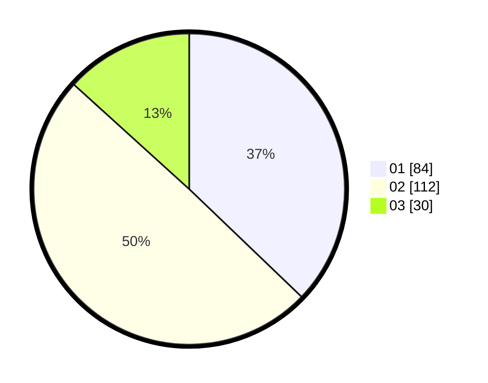

# Hasil

Hasil perolehan suara paslon dapat dilihat pada file paslon-01.txt, paslon-02.txt, dan paslon-03.txt.

Jika tidak ada, artinya data tersebut belum ada pada SIREKAP.

## Perolehan Suara

 * Paslon 01: **84**.
 * Paslon 02: **112**.
 * Paslon 03: **30**.

## Foto C Plano

https://sirekap-obj-formc.kpu.go.id/90e3/pemilu/ppwp/31/75/03/10/07/3175031007097-20240216-165328--a32834c5-2783-4f68-ab3c-dc8e4f268be0.jpg

https://sirekap-obj-formc.kpu.go.id/90e3/pemilu/ppwp/31/75/03/10/07/3175031007097-20240216-165344--873f1f73-f257-4431-bef0-aef7db0ad76f.jpg
