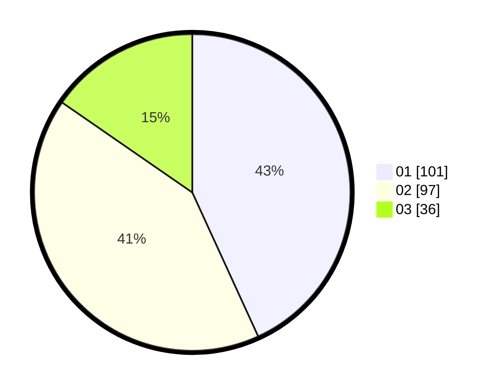

# Hasil

Hasil perolehan suara paslon dapat dilihat pada file paslon-01.txt, paslon-02.txt, dan paslon-03.txt.

Jika tidak ada, artinya data tersebut belum ada pada SIREKAP.

## Perolehan Suara

 * Paslon 01: **101**.
 * Paslon 02: **97**.
 * Paslon 03: **36**.

## Foto C Plano

https://sirekap-obj-formc.kpu.go.id/0d7c/pemilu/ppwp/31/75/03/10/07/3175031007098-20240215-010024--44037de2-9e97-4232-942a-fa7e29788145.jpg

https://sirekap-obj-formc.kpu.go.id/0d7c/pemilu/ppwp/31/75/03/10/07/3175031007098-20240215-010053--d69fc9f4-94df-4686-890e-3c931e153044.jpg
