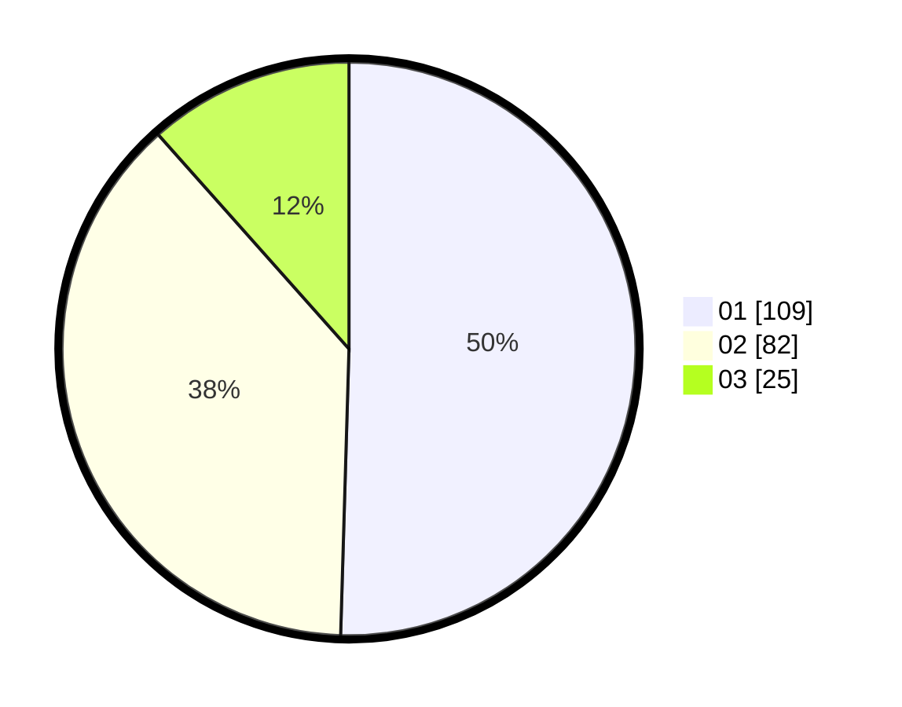

# Hasil

Hasil perolehan suara paslon dapat dilihat pada file paslon-01.txt, paslon-02.txt, dan paslon-03.txt.

Jika tidak ada, artinya data tersebut belum ada pada SIREKAP.

## Perolehan Suara

 * Paslon 01: **109**.
 * Paslon 02: **82**.
 * Paslon 03: **25**.

## Foto C Plano

https://sirekap-obj-formc.kpu.go.id/c34f/pemilu/ppwp/31/75/03/10/07/3175031007101-20240216-101420--ffe89183-add2-43b8-9b88-34d885a9fd7c.jpg

https://sirekap-obj-formc.kpu.go.id/c34f/pemilu/ppwp/31/75/03/10/07/3175031007101-20240216-081159--2a95c0af-3c09-48d3-b97f-0be6d899a64d.jpg

https://sirekap-obj-formc.kpu.go.id/c34f/pemilu/ppwp/31/75/03/10/07/3175031007101-20240216-081837--1037ae9d-f5be-4d0f-a279-07e63d800acc.jpg

## DATA PEMILIH TETAP

Jumlah pemilih dalam DPT: **288**.
 * L: **148**.
 * P: **140**.

## DATA PENGGUNA HAK PILIH

Jumlah pengguna hak pilih dalam DPT: **218**.
 * L: **108**.
 * P: **110**.

Jumlah pengguna hak pilih dalam DPTb: **2**.
 * L: **1**.
 * P: **1**.

Jumlah pengguna hak pilih dalam DPK: **1**.
 * L: **0**.
 * P: **1**.

Jumlah pengguna hak pilih: **221**.
 * L: **109**.
 * P: **112**.

## JUMLAH SUARA SAH DAN TIDAK SAH

JUMLAH SELURUH SUARA SAH: **220**.

JUMLAH SUARA TIDAK SAH: **1**.

JUMLAH SELURUH SUARA SAH DAN SUARA TIDAK SAH: **221**.
