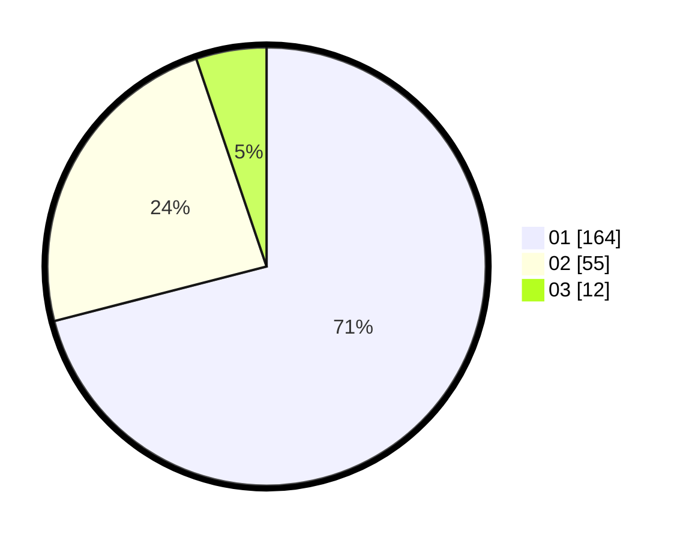

# Hasil

Hasil perolehan suara paslon dapat dilihat pada file paslon-01.txt, paslon-02.txt, dan paslon-03.txt.

Jika tidak ada, artinya data tersebut belum ada pada SIREKAP.

## Perolehan Suara

 * Paslon 01: **164**.
 * Paslon 02: **55**.
 * Paslon 03: **12**.

## Foto C Plano

https://sirekap-obj-formc.kpu.go.id/c1e1/pemilu/ppwp/31/75/03/10/07/3175031007107-20240215-001514--290e97b2-9897-4274-b427-8b9660505709.jpg

https://sirekap-obj-formc.kpu.go.id/c1e1/pemilu/ppwp/31/75/03/10/07/3175031007107-20240216-153440--d371f590-0afb-45f5-98f4-38b128e4f2cc.jpg

https://sirekap-obj-formc.kpu.go.id/c1e1/pemilu/ppwp/31/75/03/10/07/3175031007107-20240216-153550--84a77ed2-f566-4867-8bce-dc5fb97f2dfe.jpg
