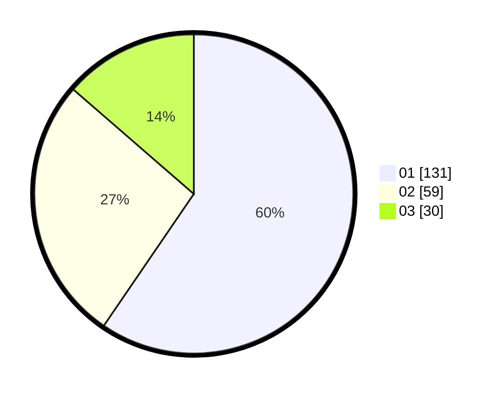

# Hasil

Hasil perolehan suara paslon dapat dilihat pada file paslon-01.txt, paslon-02.txt, dan paslon-03.txt.

Jika tidak ada, artinya data tersebut belum ada pada SIREKAP.

## Perolehan Suara

 * Paslon 01: **131**.
 * Paslon 02: **59**.
 * Paslon 03: **30**.

## Foto C Plano

https://sirekap-obj-formc.kpu.go.id/63ab/pemilu/ppwp/31/75/03/10/07/3175031007114-20240217-021120--a2594932-464d-4831-b702-88a4fb893b41.jpg

https://sirekap-obj-formc.kpu.go.id/63ab/pemilu/ppwp/31/75/03/10/07/3175031007114-20240217-021122--95436cbf-f308-4ec6-bb14-5ba5577f48e3.jpg

https://sirekap-obj-formc.kpu.go.id/63ab/pemilu/ppwp/31/75/03/10/07/3175031007114-20240217-021121--563a5c83-e53f-4252-99ec-6abdfcf64505.jpg

## DATA PEMILIH TETAP

Jumlah pemilih dalam DPT: **260**.
 * L: **126**.
 * P: **134**.

## DATA PENGGUNA HAK PILIH

Jumlah pengguna hak pilih dalam DPT: **205**.
 * L: **91**.
 * P: **114**.

Jumlah pengguna hak pilih dalam DPTb: **15**.
 * L: **5**.
 * P: **10**.

Jumlah pengguna hak pilih dalam DPK: **3**.
 * L: **1**.
 * P: **2**.

Jumlah pengguna hak pilih: **223**.
 * L: **97**.
 * P: **126**.

## JUMLAH SUARA SAH DAN TIDAK SAH

JUMLAH SELURUH SUARA SAH: **220**.

JUMLAH SUARA TIDAK SAH: **3**.

JUMLAH SELURUH SUARA SAH DAN SUARA TIDAK SAH: **223**.
