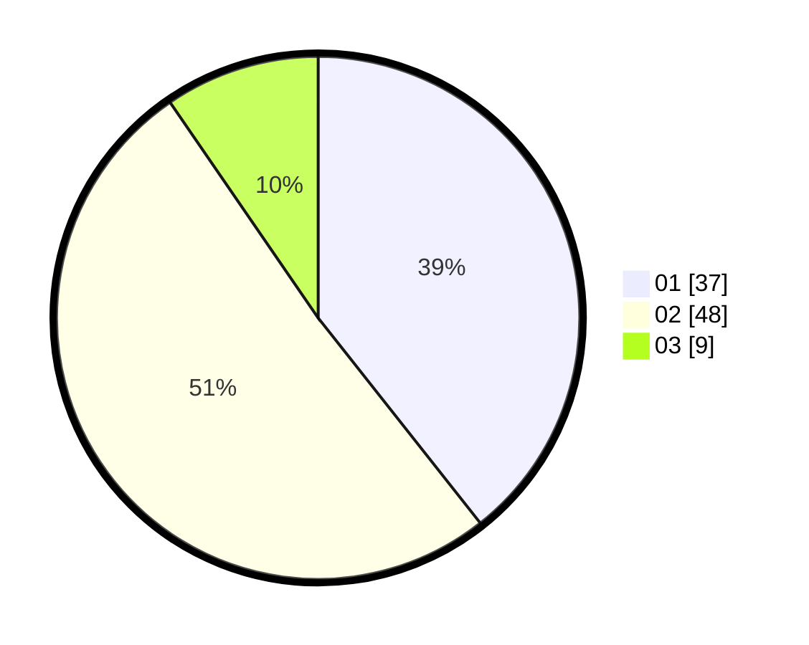

# Hasil

Hasil perolehan suara paslon dapat dilihat pada file paslon-01.txt, paslon-02.txt, dan paslon-03.txt.

Jika tidak ada, artinya data tersebut belum ada pada SIREKAP.

## Perolehan Suara

 * Paslon 01: **37**.
 * Paslon 02: **48**.
 * Paslon 03: **9**.

## Foto C Plano

https://sirekap-obj-formc.kpu.go.id/1eed/pemilu/ppwp/31/75/03/10/07/3175031007903-20240214-193652--00627938-487f-4a2e-a013-092a70c3f063.jpg

https://sirekap-obj-formc.kpu.go.id/1eed/pemilu/ppwp/31/75/03/10/07/3175031007903-20240214-200313--4949b563-b488-4c40-8877-1a1c2cab969c.jpg

https://sirekap-obj-formc.kpu.go.id/1eed/pemilu/ppwp/31/75/03/10/07/3175031007903-20240215-175551--28dde3b8-7e56-48c3-bfb7-cf3614651306.jpg

## DATA PEMILIH TETAP

Jumlah pemilih dalam DPT: **193**.
 * L: **112**.
 * P: **81**.

## DATA PENGGUNA HAK PILIH

Jumlah pengguna hak pilih dalam DPT: **82**.
 * L: **51**.
 * P: **31**.

Jumlah pengguna hak pilih dalam DPTb: **14**.
 * L: **6**.
 * P: **8**.

Jumlah pengguna hak pilih dalam DPK: **0**.
 * L: **0**.
 * P: **0**.

Jumlah pengguna hak pilih: **96**.
 * L: **57**.
 * P: **39**.

## JUMLAH SUARA SAH DAN TIDAK SAH

JUMLAH SELURUH SUARA SAH: **94**.

JUMLAH SUARA TIDAK SAH: **2**.

JUMLAH SELURUH SUARA SAH DAN SUARA TIDAK SAH: **96**.
