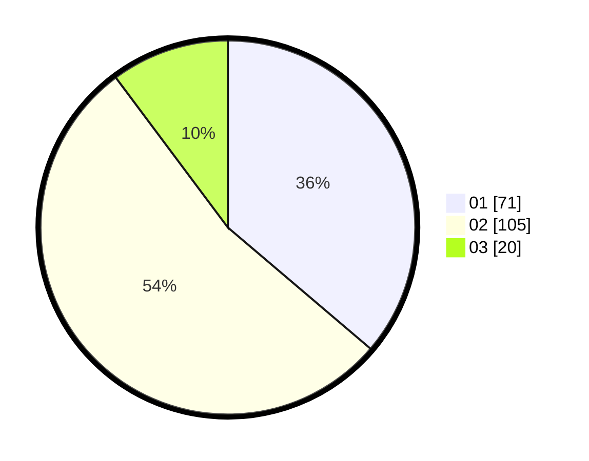

# Hasil

Hasil perolehan suara paslon dapat dilihat pada file paslon-01.txt, paslon-02.txt, dan paslon-03.txt.

Jika tidak ada, artinya data tersebut belum ada pada SIREKAP.

## Perolehan Suara

 * Paslon 01: **71**.
 * Paslon 02: **105**.
 * Paslon 03: **20**.

## Foto C Plano

https://sirekap-obj-formc.kpu.go.id/ea3b/pemilu/ppwp/31/75/03/10/08/3175031008003-20240214-204829--130e7f45-b9b5-483b-b430-0e44a001b6b6.jpg

https://sirekap-obj-formc.kpu.go.id/ea3b/pemilu/ppwp/31/75/03/10/08/3175031008003-20240214-205225--86089eab-432f-49af-8a56-9728bc37afdb.jpg

https://sirekap-obj-formc.kpu.go.id/ea3b/pemilu/ppwp/31/75/03/10/08/3175031008003-20240214-215241--23ff1bfd-4b2d-467b-85b9-752f58f8a85d.jpg
