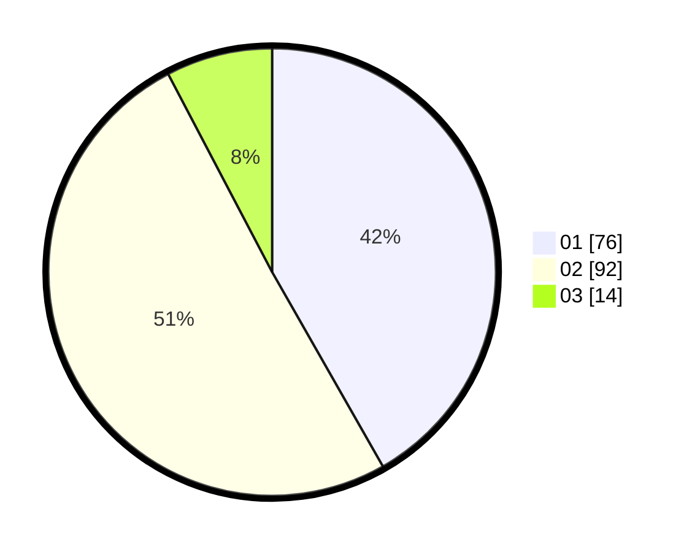

# Hasil

Hasil perolehan suara paslon dapat dilihat pada file paslon-01.txt, paslon-02.txt, dan paslon-03.txt.

Jika tidak ada, artinya data tersebut belum ada pada SIREKAP.

## Perolehan Suara

 * Paslon 01: **76**.
 * Paslon 02: **92**.
 * Paslon 03: **14**.

## Foto C Plano

https://sirekap-obj-formc.kpu.go.id/b6dd/pemilu/ppwp/31/75/03/10/08/3175031008005-20240216-143048--2d5ecb38-7425-4e74-9c47-2d74defdd441.jpg

https://sirekap-obj-formc.kpu.go.id/b6dd/pemilu/ppwp/31/75/03/10/08/3175031008005-20240216-143049--01037859-ff24-4a6e-87ba-d3abcb8388bc.jpg

https://sirekap-obj-formc.kpu.go.id/b6dd/pemilu/ppwp/31/75/03/10/08/3175031008005-20240216-143048--6ede7258-4d15-4ed8-9e8a-56aa7b520fc7.jpg

## DATA PEMILIH TETAP

Jumlah pemilih dalam DPT: **269**.
 * L: **144**.
 * P: **125**.

## DATA PENGGUNA HAK PILIH

Jumlah pengguna hak pilih dalam DPT: **184**.
 * L: **95**.
 * P: **89**.

Jumlah pengguna hak pilih dalam DPTb: **0**.
 * L: **0**.
 * P: **0**.

Jumlah pengguna hak pilih dalam DPK: **0**.
 * L: **0**.
 * P: **0**.

Jumlah pengguna hak pilih: **184**.
 * L: **95**.
 * P: **89**.

## JUMLAH SUARA SAH DAN TIDAK SAH

JUMLAH SELURUH SUARA SAH: **182**.

JUMLAH SUARA TIDAK SAH: **2**.

JUMLAH SELURUH SUARA SAH DAN SUARA TIDAK SAH: **184**.
