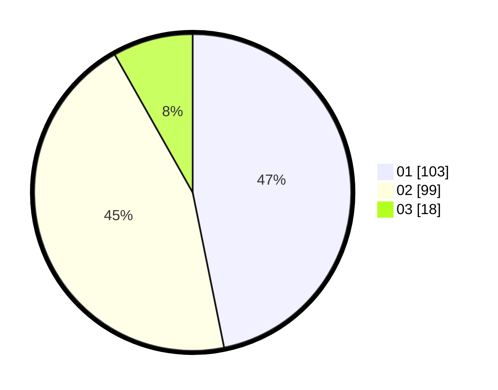

# Hasil

Hasil perolehan suara paslon dapat dilihat pada file paslon-01.txt, paslon-02.txt, dan paslon-03.txt.

Jika tidak ada, artinya data tersebut belum ada pada SIREKAP.

## Perolehan Suara

 * Paslon 01: **103**.
 * Paslon 02: **99**.
 * Paslon 03: **18**.

## Foto C Plano

https://sirekap-obj-formc.kpu.go.id/aabf/pemilu/ppwp/31/75/03/10/08/3175031008014-20240214-202416--cf90fc0e-6307-42ad-b3d1-b6e78d050e44.jpg

https://sirekap-obj-formc.kpu.go.id/aabf/pemilu/ppwp/31/75/03/10/08/3175031008014-20240214-180827--bcf5f80c-7925-4d86-84fb-19d8f3121107.jpg

https://sirekap-obj-formc.kpu.go.id/aabf/pemilu/ppwp/31/75/03/10/08/3175031008014-20240216-143139--5e47bf82-daec-4f2e-a9b5-7e21f63c295f.jpg

## DATA PEMILIH TETAP

Jumlah pemilih dalam DPT: **283**.
 * L: **143**.
 * P: **140**.

## DATA PENGGUNA HAK PILIH

Jumlah pengguna hak pilih dalam DPT: **216**.
 * L: **106**.
 * P: **110**.

Jumlah pengguna hak pilih dalam DPTb: **1**.
 * L: **0**.
 * P: **1**.

Jumlah pengguna hak pilih dalam DPK: **8**.
 * L: **6**.
 * P: **2**.

Jumlah pengguna hak pilih: **225**.
 * L: **112**.
 * P: **113**.

## JUMLAH SUARA SAH DAN TIDAK SAH

JUMLAH SELURUH SUARA SAH: **220**.

JUMLAH SUARA TIDAK SAH: **5**.

JUMLAH SELURUH SUARA SAH DAN SUARA TIDAK SAH: **225**.
