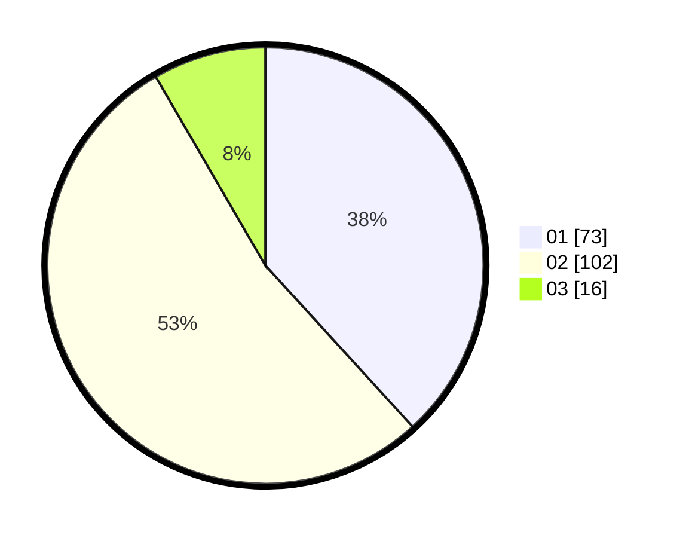

# Hasil

Hasil perolehan suara paslon dapat dilihat pada file paslon-01.txt, paslon-02.txt, dan paslon-03.txt.

Jika tidak ada, artinya data tersebut belum ada pada SIREKAP.

## Perolehan Suara

 * Paslon 01: **73**.
 * Paslon 02: **102**.
 * Paslon 03: **16**.

## Foto C Plano

https://sirekap-obj-formc.kpu.go.id/c460/pemilu/ppwp/31/75/03/10/08/3175031008015-20240214-222055--e66b407e-e8a4-4505-9891-6be8cee3816d.jpg

https://sirekap-obj-formc.kpu.go.id/c460/pemilu/ppwp/31/75/03/10/08/3175031008015-20240214-223121--995bfc67-4d05-4754-a733-e806e7465adc.jpg

https://sirekap-obj-formc.kpu.go.id/c460/pemilu/ppwp/31/75/03/10/08/3175031008015-20240214-223341--d87991ab-0f33-449a-bb4d-853e2fedb24c.jpg

## DATA PEMILIH TETAP

Jumlah pemilih dalam DPT: **288**.
 * L: **147**.
 * P: **141**.

## DATA PENGGUNA HAK PILIH

Jumlah pengguna hak pilih dalam DPT: **195**.
 * L: **94**.
 * P: **101**.

Jumlah pengguna hak pilih dalam DPTb: **0**.
 * L: **0**.
 * P: **0**.

Jumlah pengguna hak pilih dalam DPK: **1**.
 * L: **0**.
 * P: **1**.

Jumlah pengguna hak pilih: **196**.
 * L: **94**.
 * P: **102**.

## JUMLAH SUARA SAH DAN TIDAK SAH

JUMLAH SELURUH SUARA SAH: **191**.

JUMLAH SUARA TIDAK SAH: **5**.

JUMLAH SELURUH SUARA SAH DAN SUARA TIDAK SAH: **196**.
