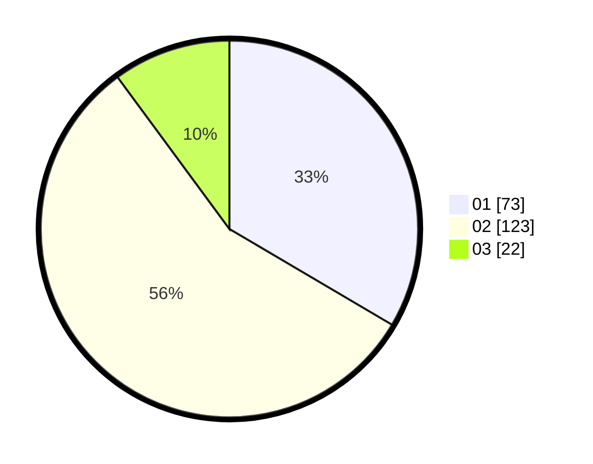

# Hasil

Hasil perolehan suara paslon dapat dilihat pada file paslon-01.txt, paslon-02.txt, dan paslon-03.txt.

Jika tidak ada, artinya data tersebut belum ada pada SIREKAP.

## Perolehan Suara

 * Paslon 01: **73**.
 * Paslon 02: **123**.
 * Paslon 03: **22**.

## Foto C Plano

https://sirekap-obj-formc.kpu.go.id/a1a6/pemilu/ppwp/31/75/03/10/08/3175031008016-20240216-054534--b10f46a2-2178-40fb-893f-bc60d40fe626.jpg

https://sirekap-obj-formc.kpu.go.id/a1a6/pemilu/ppwp/31/75/03/10/08/3175031008016-20240216-054535--42c3b831-3f43-4acb-92d4-10672afce7f2.jpg

https://sirekap-obj-formc.kpu.go.id/a1a6/pemilu/ppwp/31/75/03/10/08/3175031008016-20240216-054535--21da7a56-9a4c-4f3e-a90d-d7abf44f6ee6.jpg

## DATA PEMILIH TETAP

Jumlah pemilih dalam DPT: **285**.
 * L: **148**.
 * P: **137**.

## DATA PENGGUNA HAK PILIH

Jumlah pengguna hak pilih dalam DPT: **222**.
 * L: **110**.
 * P: **112**.

Jumlah pengguna hak pilih dalam DPTb: **0**.
 * L: **0**.
 * P: **0**.

Jumlah pengguna hak pilih dalam DPK: **2**.
 * L: **2**.
 * P: **0**.

Jumlah pengguna hak pilih: **224**.
 * L: **112**.
 * P: **112**.

## JUMLAH SUARA SAH DAN TIDAK SAH

JUMLAH SELURUH SUARA SAH: **218**.

JUMLAH SUARA TIDAK SAH: **7**.

JUMLAH SELURUH SUARA SAH DAN SUARA TIDAK SAH: **225**.
