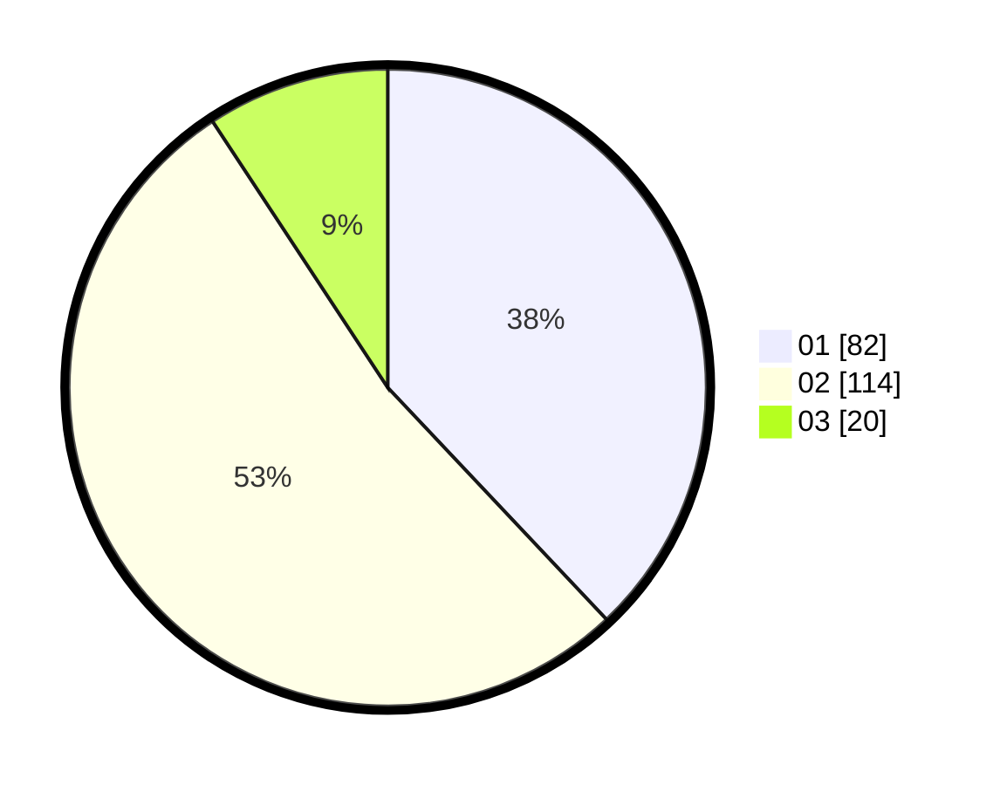

# Hasil

Hasil perolehan suara paslon dapat dilihat pada file paslon-01.txt, paslon-02.txt, dan paslon-03.txt.

Jika tidak ada, artinya data tersebut belum ada pada SIREKAP.

## Perolehan Suara

 * Paslon 01: **82**.
 * Paslon 02: **114**.
 * Paslon 03: **20**.

## Foto C Plano

https://sirekap-obj-formc.kpu.go.id/2cc8/pemilu/ppwp/31/75/03/10/08/3175031008018-20240216-033504--c8f43369-edd5-4ba4-b652-1a28048c273e.jpg

https://sirekap-obj-formc.kpu.go.id/2cc8/pemilu/ppwp/31/75/03/10/08/3175031008018-20240216-033505--f2ebb153-bb45-4745-9208-d5446f41a980.jpg

https://sirekap-obj-formc.kpu.go.id/2cc8/pemilu/ppwp/31/75/03/10/08/3175031008018-20240216-033505--be2431c8-1269-45eb-8f97-8648aac140a3.jpg

## DATA PEMILIH TETAP

Jumlah pemilih dalam DPT: **286**.
 * L: **150**.
 * P: **136**.

## DATA PENGGUNA HAK PILIH

Jumlah pengguna hak pilih dalam DPT: **217**.
 * L: **109**.
 * P: **108**.

Jumlah pengguna hak pilih dalam DPTb: **0**.
 * L: **0**.
 * P: **0**.

Jumlah pengguna hak pilih dalam DPK: **1**.
 * L: **0**.
 * P: **1**.

Jumlah pengguna hak pilih: **218**.
 * L: **109**.
 * P: **109**.

## JUMLAH SUARA SAH DAN TIDAK SAH

JUMLAH SELURUH SUARA SAH: **216**.

JUMLAH SUARA TIDAK SAH: **2**.

JUMLAH SELURUH SUARA SAH DAN SUARA TIDAK SAH: **218**.
