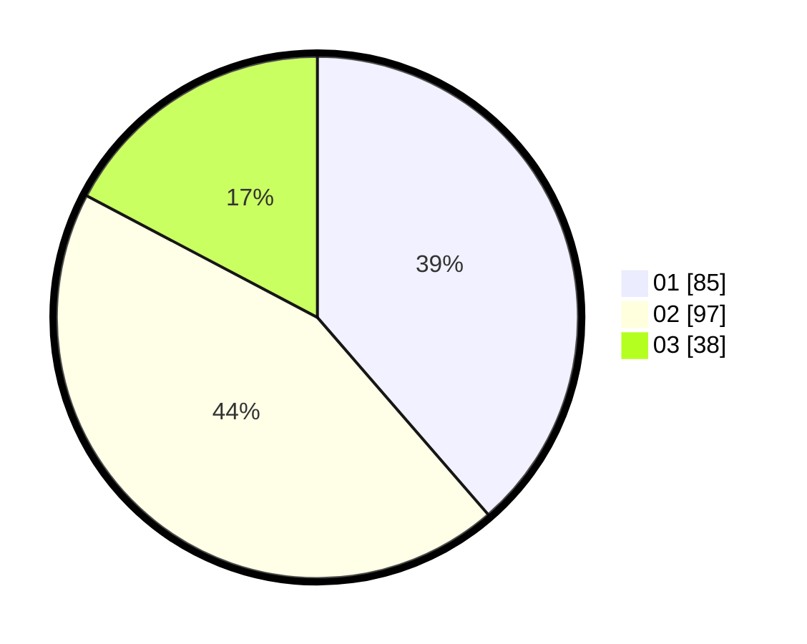

# Hasil

Hasil perolehan suara paslon dapat dilihat pada file paslon-01.txt, paslon-02.txt, dan paslon-03.txt.

Jika tidak ada, artinya data tersebut belum ada pada SIREKAP.

## Perolehan Suara

 * Paslon 01: **85**.
 * Paslon 02: **97**.
 * Paslon 03: **38**.

## Foto C Plano

https://sirekap-obj-formc.kpu.go.id/0fcb/pemilu/ppwp/31/75/03/10/08/3175031008025-20240214-155208--b7edf39c-65f8-437a-8f77-5cba1a5730c9.jpg

https://sirekap-obj-formc.kpu.go.id/0fcb/pemilu/ppwp/31/75/03/10/08/3175031008025-20240215-234741--fa7d47cb-bec8-4cb8-9fe3-50528d009689.jpg

https://sirekap-obj-formc.kpu.go.id/0fcb/pemilu/ppwp/31/75/03/10/08/3175031008025-20240215-234739--e6615fd5-4f3c-4029-87d5-2e0b4ae7e077.jpg

## DATA PEMILIH TETAP

Jumlah pemilih dalam DPT: **278**.
 * L: **141**.
 * P: **137**.

## DATA PENGGUNA HAK PILIH

Jumlah pengguna hak pilih dalam DPT: **218**.
 * L: **105**.
 * P: **113**.

Jumlah pengguna hak pilih dalam DPTb: **4**.
 * L: **2**.
 * P: **2**.

Jumlah pengguna hak pilih dalam DPK: **2**.
 * L: **2**.
 * P: **0**.

Jumlah pengguna hak pilih: **224**.
 * L: **109**.
 * P: **115**.

## JUMLAH SUARA SAH DAN TIDAK SAH

JUMLAH SELURUH SUARA SAH: **220**.

JUMLAH SUARA TIDAK SAH: **4**.

JUMLAH SELURUH SUARA SAH DAN SUARA TIDAK SAH: **224**.
