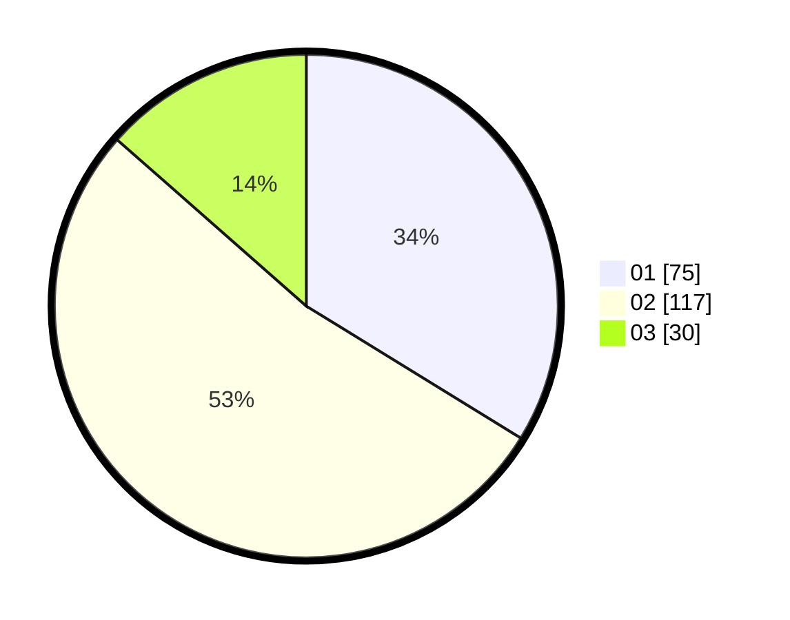

# Hasil

Hasil perolehan suara paslon dapat dilihat pada file paslon-01.txt, paslon-02.txt, dan paslon-03.txt.

Jika tidak ada, artinya data tersebut belum ada pada SIREKAP.

## Perolehan Suara

 * Paslon 01: **75**.
 * Paslon 02: **117**.
 * Paslon 03: **30**.

## Foto C Plano

https://sirekap-obj-formc.kpu.go.id/d46c/pemilu/ppwp/31/75/03/10/08/3175031008028-20240216-144537--3d97caec-11a6-4c6d-af2c-8a3369d95502.jpg

https://sirekap-obj-formc.kpu.go.id/d46c/pemilu/ppwp/31/75/03/10/08/3175031008028-20240216-035518--c499d1b2-d74e-489c-b83b-1e1b2748af4a.jpg

https://sirekap-obj-formc.kpu.go.id/d46c/pemilu/ppwp/31/75/03/10/08/3175031008028-20240216-035517--6d5577d9-1879-41a1-bfe5-efd66e3fb003.jpg

## DATA PEMILIH TETAP

Jumlah pemilih dalam DPT: **271**.
 * L: **147**.
 * P: **124**.

## DATA PENGGUNA HAK PILIH

Jumlah pengguna hak pilih dalam DPT: **220**.
 * L: **116**.
 * P: **104**.

Jumlah pengguna hak pilih dalam DPTb: **1**.
 * L: **0**.
 * P: **1**.

Jumlah pengguna hak pilih dalam DPK: **5**.
 * L: **3**.
 * P: **2**.

Jumlah pengguna hak pilih: **226**.
 * L: **119**.
 * P: **107**.

## JUMLAH SUARA SAH DAN TIDAK SAH

JUMLAH SELURUH SUARA SAH: **222**.

JUMLAH SUARA TIDAK SAH: **4**.

JUMLAH SELURUH SUARA SAH DAN SUARA TIDAK SAH: **226**.
