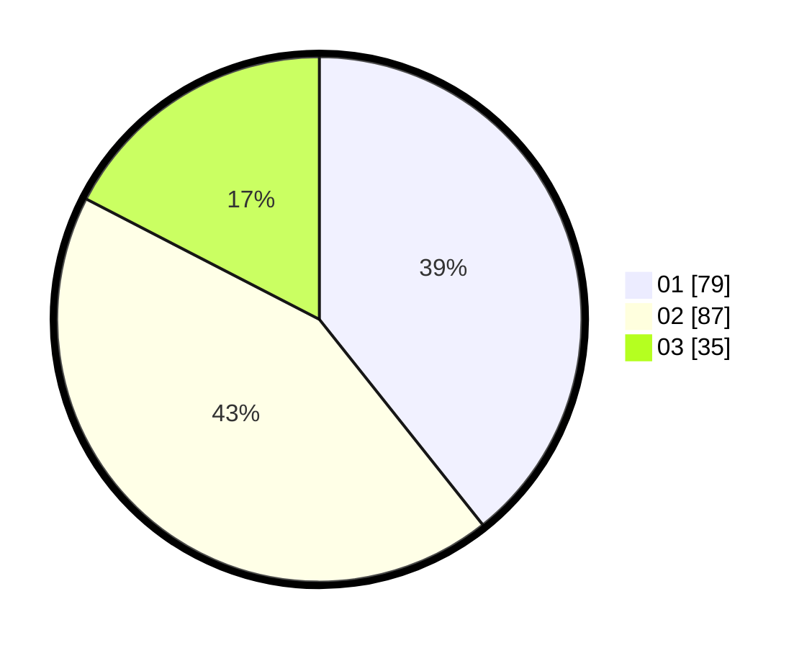

# Hasil

Hasil perolehan suara paslon dapat dilihat pada file paslon-01.txt, paslon-02.txt, dan paslon-03.txt.

Jika tidak ada, artinya data tersebut belum ada pada SIREKAP.

## Perolehan Suara

 * Paslon 01: **79**.
 * Paslon 02: **87**.
 * Paslon 03: **35**.

## Foto C Plano

https://sirekap-obj-formc.kpu.go.id/37a1/pemilu/ppwp/31/75/03/10/08/3175031008030-20240215-001730--cc0cd49f-e64b-4359-abb2-9af06309c79b.jpg

https://sirekap-obj-formc.kpu.go.id/37a1/pemilu/ppwp/31/75/03/10/08/3175031008030-20240215-001959--72bab88f-5244-416e-8383-2446e219e4e2.jpg

https://sirekap-obj-formc.kpu.go.id/37a1/pemilu/ppwp/31/75/03/10/08/3175031008030-20240215-024404--7421fe97-9467-42c5-97d2-4d904eb27a26.jpg

## DATA PEMILIH TETAP

Jumlah pemilih dalam DPT: **270**.
 * L: **138**.
 * P: **132**.

## DATA PENGGUNA HAK PILIH

Jumlah pengguna hak pilih dalam DPT: **202**.
 * L: **102**.
 * P: **100**.

Jumlah pengguna hak pilih dalam DPTb: **0**.
 * L: **0**.
 * P: **0**.

Jumlah pengguna hak pilih dalam DPK: **0**.
 * L: **0**.
 * P: **0**.

Jumlah pengguna hak pilih: **202**.
 * L: **102**.
 * P: **100**.

## JUMLAH SUARA SAH DAN TIDAK SAH

JUMLAH SELURUH SUARA SAH: **201**.

JUMLAH SUARA TIDAK SAH: **1**.

JUMLAH SELURUH SUARA SAH DAN SUARA TIDAK SAH: **202**.
