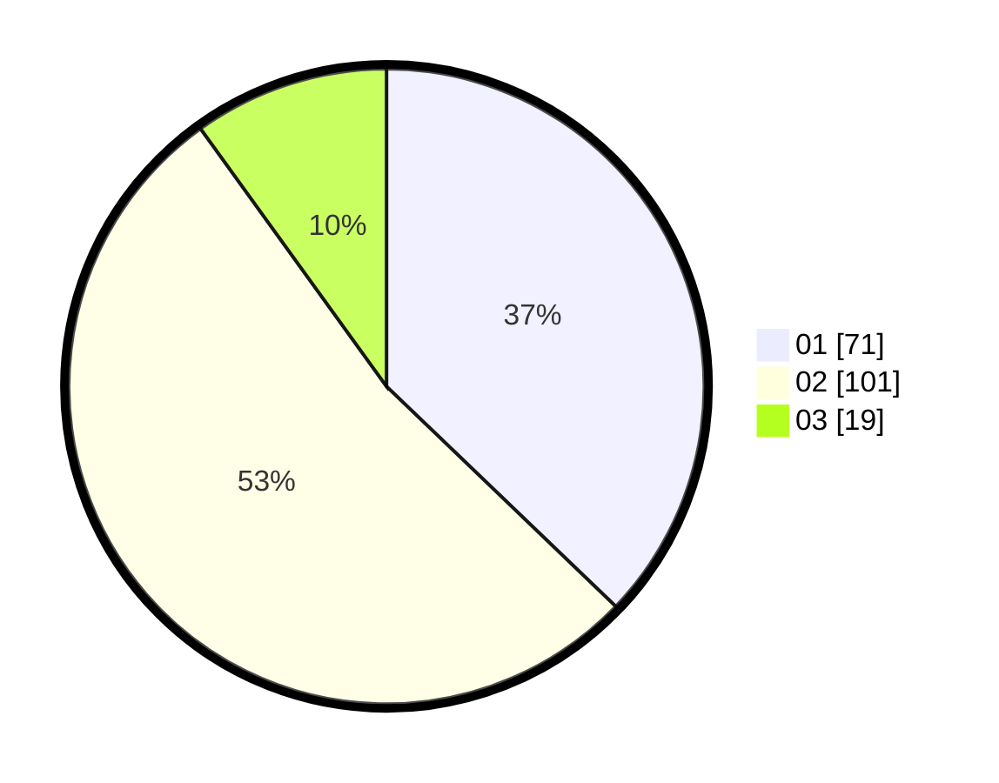

# Hasil

Hasil perolehan suara paslon dapat dilihat pada file paslon-01.txt, paslon-02.txt, dan paslon-03.txt.

Jika tidak ada, artinya data tersebut belum ada pada SIREKAP.

## Perolehan Suara

 * Paslon 01: **71**.
 * Paslon 02: **101**.
 * Paslon 03: **19**.

## Foto C Plano

https://sirekap-obj-formc.kpu.go.id/d663/pemilu/ppwp/31/75/03/10/08/3175031008032-20240214-195806--6acf15b5-cda4-4c57-ad5f-c94eea9498d1.jpg

https://sirekap-obj-formc.kpu.go.id/d663/pemilu/ppwp/31/75/03/10/08/3175031008032-20240214-195845--0a0fccb9-8b24-4e01-b4a8-a8fd6717ad39.jpg

https://sirekap-obj-formc.kpu.go.id/d663/pemilu/ppwp/31/75/03/10/08/3175031008032-20240214-195913--bbda2733-7373-451a-be55-eacf845e6e26.jpg

## DATA PEMILIH TETAP

Jumlah pemilih dalam DPT: **277**.
 * L: **146**.
 * P: **126**.

## DATA PENGGUNA HAK PILIH

Jumlah pengguna hak pilih dalam DPT: **202**.
 * L: **103**.
 * P: **99**.

Jumlah pengguna hak pilih dalam DPTb: **0**.
 * L: **0**.
 * P: **0**.

Jumlah pengguna hak pilih dalam DPK: **0**.
 * L: **0**.
 * P: **0**.

Jumlah pengguna hak pilih: **202**.
 * L: **103**.
 * P: **99**.

## JUMLAH SUARA SAH DAN TIDAK SAH

JUMLAH SELURUH SUARA SAH: **191**.

JUMLAH SUARA TIDAK SAH: **11**.

JUMLAH SELURUH SUARA SAH DAN SUARA TIDAK SAH: **202**.
