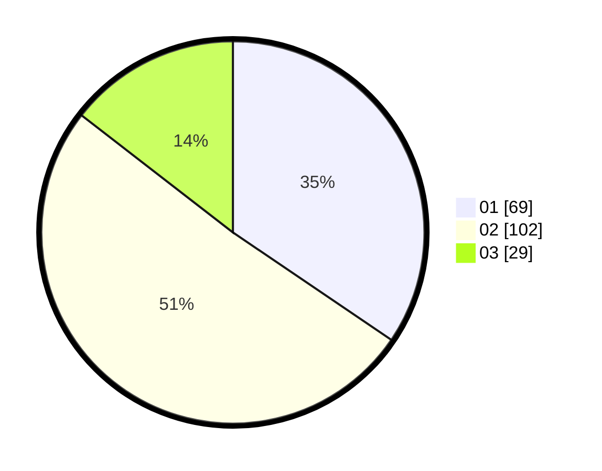

# Hasil

Hasil perolehan suara paslon dapat dilihat pada file paslon-01.txt, paslon-02.txt, dan paslon-03.txt.

Jika tidak ada, artinya data tersebut belum ada pada SIREKAP.

## Perolehan Suara

 * Paslon 01: **69**.
 * Paslon 02: **102**.
 * Paslon 03: **29**.

## Foto C Plano

https://sirekap-obj-formc.kpu.go.id/a92d/pemilu/ppwp/31/75/03/10/08/3175031008033-20240216-125312--ff216311-fb3a-4225-964b-2af28d05ae76.jpg

https://sirekap-obj-formc.kpu.go.id/a92d/pemilu/ppwp/31/75/03/10/08/3175031008033-20240216-125315--4bab870c-1fd0-443f-804d-0921f26ca20d.jpg

https://sirekap-obj-formc.kpu.go.id/a92d/pemilu/ppwp/31/75/03/10/08/3175031008033-20240216-125314--9a99b85b-123f-4381-976a-d73a856a56a7.jpg

## DATA PEMILIH TETAP

Jumlah pemilih dalam DPT: **264**.
 * L: **142**.
 * P: **122**.

## DATA PENGGUNA HAK PILIH

Jumlah pengguna hak pilih dalam DPT: **206**.
 * L: **107**.
 * P: **99**.

Jumlah pengguna hak pilih dalam DPTb: **0**.
 * L: **0**.
 * P: **0**.

Jumlah pengguna hak pilih dalam DPK: **3**.
 * L: **2**.
 * P: **1**.

Jumlah pengguna hak pilih: **209**.
 * L: **109**.
 * P: **100**.

## JUMLAH SUARA SAH DAN TIDAK SAH

JUMLAH SELURUH SUARA SAH: **200**.

JUMLAH SUARA TIDAK SAH: **9**.

JUMLAH SELURUH SUARA SAH DAN SUARA TIDAK SAH: **209**.
