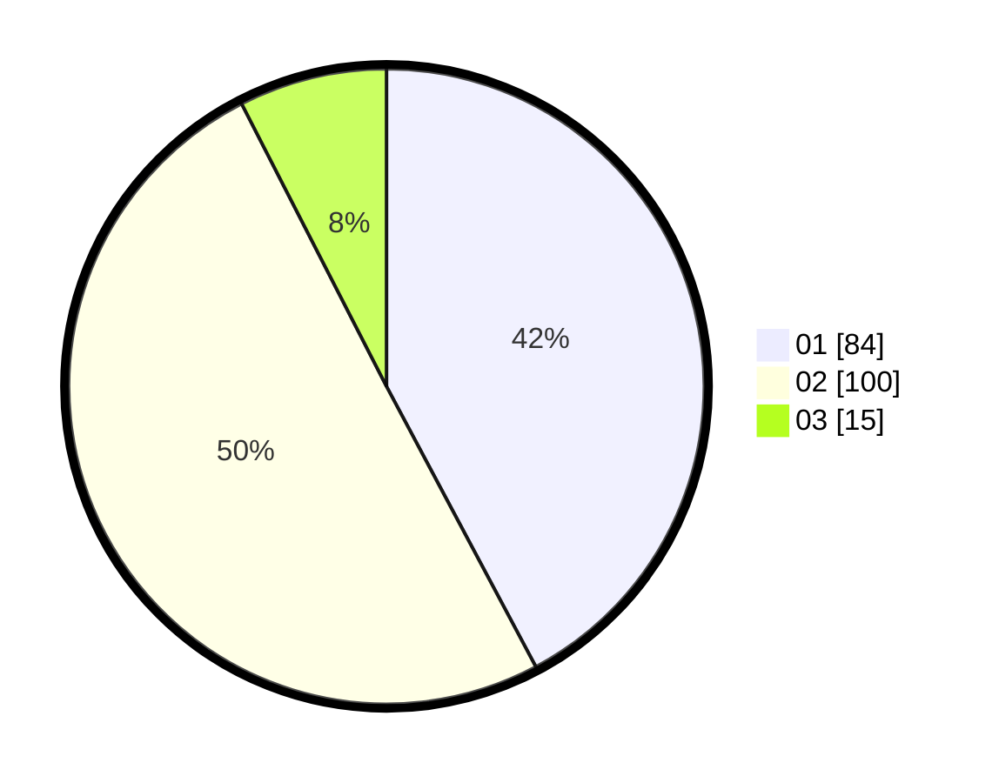

# Hasil

Hasil perolehan suara paslon dapat dilihat pada file paslon-01.txt, paslon-02.txt, dan paslon-03.txt.

Jika tidak ada, artinya data tersebut belum ada pada SIREKAP.

## Perolehan Suara

 * Paslon 01: **84**.
 * Paslon 02: **100**.
 * Paslon 03: **15**.

## Foto C Plano

https://sirekap-obj-formc.kpu.go.id/d8a5/pemilu/ppwp/31/75/03/10/08/3175031008034-20240215-012624--2faa0f23-dbfa-4ef2-9296-ff409ed0dc4d.jpg

https://sirekap-obj-formc.kpu.go.id/d8a5/pemilu/ppwp/31/75/03/10/08/3175031008034-20240215-012728--5cf14427-2262-475b-85e7-63dbd3f9a897.jpg

https://sirekap-obj-formc.kpu.go.id/d8a5/pemilu/ppwp/31/75/03/10/08/3175031008034-20240215-012913--8cee169b-c91b-46b7-a0d5-f360b7fe6113.jpg

## DATA PEMILIH TETAP

Jumlah pemilih dalam DPT: **267**.
 * L: **146**.
 * P: **121**.

## DATA PENGGUNA HAK PILIH

Jumlah pengguna hak pilih dalam DPT: **204**.
 * L: **100**.
 * P: **104**.

Jumlah pengguna hak pilih dalam DPTb: **0**.
 * L: **0**.
 * P: **0**.

Jumlah pengguna hak pilih dalam DPK: **0**.
 * L: **0**.
 * P: **0**.

Jumlah pengguna hak pilih: **204**.
 * L: **100**.
 * P: **104**.

## JUMLAH SUARA SAH DAN TIDAK SAH

JUMLAH SELURUH SUARA SAH: **199**.

JUMLAH SUARA TIDAK SAH: **5**.

JUMLAH SELURUH SUARA SAH DAN SUARA TIDAK SAH: **204**.
