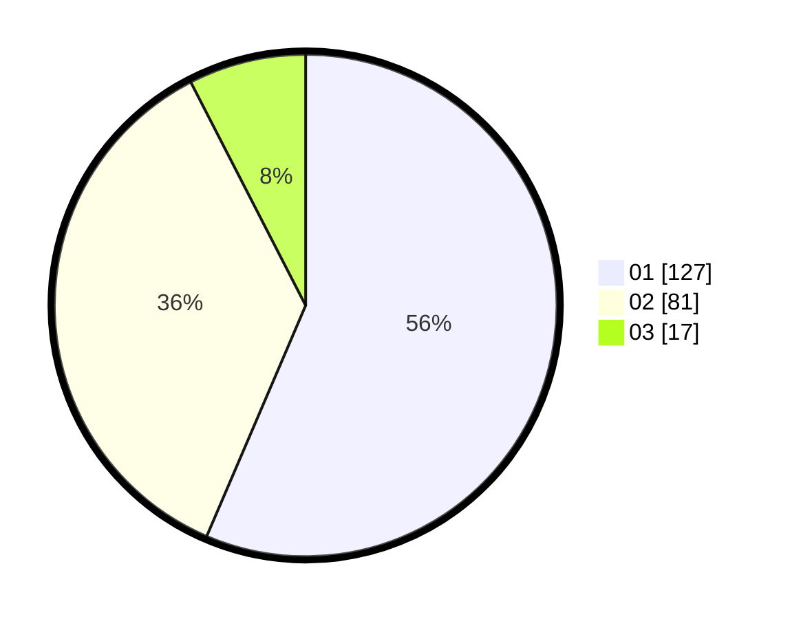

# Hasil

Hasil perolehan suara paslon dapat dilihat pada file paslon-01.txt, paslon-02.txt, dan paslon-03.txt.

Jika tidak ada, artinya data tersebut belum ada pada SIREKAP.

## Perolehan Suara

 * Paslon 01: **127**.
 * Paslon 02: **81**.
 * Paslon 03: **17**.

## Foto C Plano

https://sirekap-obj-formc.kpu.go.id/45bf/pemilu/ppwp/31/75/03/10/08/3175031008035-20240215-015938--7702185b-018b-4621-88f2-fc131c11f09b.jpg

https://sirekap-obj-formc.kpu.go.id/45bf/pemilu/ppwp/31/75/03/10/08/3175031008035-20240216-134511--b886afb6-6a35-4b2d-b1bd-e3a70b01670b.jpg

https://sirekap-obj-formc.kpu.go.id/45bf/pemilu/ppwp/31/75/03/10/08/3175031008035-20240216-134511--0e3521ff-5973-4751-9907-910311f1276a.jpg

## DATA PEMILIH TETAP

Jumlah pemilih dalam DPT: **272**.
 * L: **147**.
 * P: **125**.

## DATA PENGGUNA HAK PILIH

Jumlah pengguna hak pilih dalam DPT: **223**.
 * L: **121**.
 * P: **102**.

Jumlah pengguna hak pilih dalam DPTb: **5**.
 * L: **2**.
 * P: **13**.

Jumlah pengguna hak pilih dalam DPK: **1**.
 * L: **1**.
 * P: **0**.

Jumlah pengguna hak pilih: **229**.
 * L: **124**.
 * P: **105**.

## JUMLAH SUARA SAH DAN TIDAK SAH

JUMLAH SELURUH SUARA SAH: **225**.

JUMLAH SUARA TIDAK SAH: **4**.

JUMLAH SELURUH SUARA SAH DAN SUARA TIDAK SAH: **229**.
