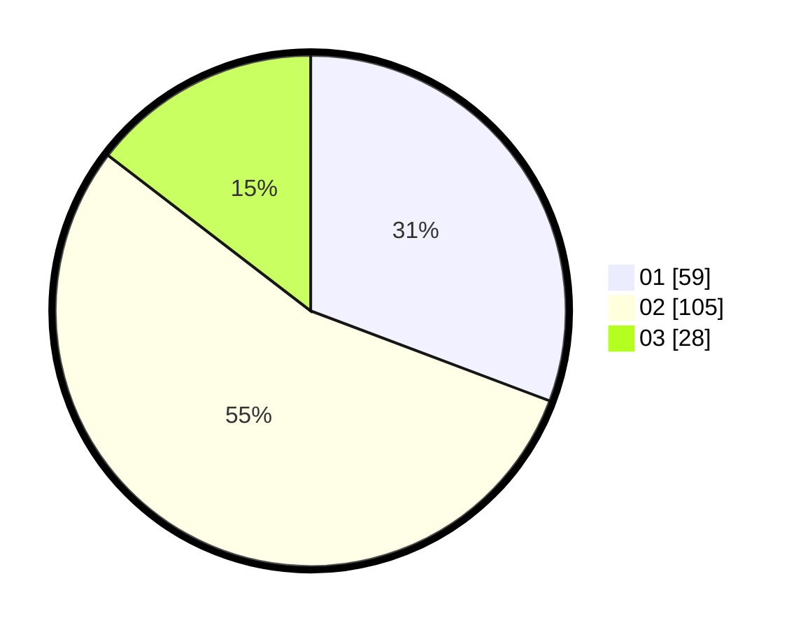

# Hasil

Hasil perolehan suara paslon dapat dilihat pada file paslon-01.txt, paslon-02.txt, dan paslon-03.txt.

Jika tidak ada, artinya data tersebut belum ada pada SIREKAP.

## Perolehan Suara

 * Paslon 01: **59**.
 * Paslon 02: **105**.
 * Paslon 03: **28**.

## Foto C Plano

https://sirekap-obj-formc.kpu.go.id/5bc7/pemilu/ppwp/31/75/03/10/08/3175031008039-20240216-004501--d85ea57a-021b-48d8-82b6-6181b0cdc5d4.jpg

https://sirekap-obj-formc.kpu.go.id/5bc7/pemilu/ppwp/31/75/03/10/08/3175031008039-20240216-004511--499665d8-b8dd-42e5-accf-8cdda81efeae.jpg

https://sirekap-obj-formc.kpu.go.id/5bc7/pemilu/ppwp/31/75/03/10/08/3175031008039-20240216-004506--33be76a0-0968-4a48-9233-4145ae8bc8be.jpg

## DATA PEMILIH TETAP

Jumlah pemilih dalam DPT: **271**.
 * L: **151**.
 * P: **120**.

## DATA PENGGUNA HAK PILIH

Jumlah pengguna hak pilih dalam DPT: **192**.
 * L: **104**.
 * P: **88**.

Jumlah pengguna hak pilih dalam DPTb: **0**.
 * L: **0**.
 * P: **0**.

Jumlah pengguna hak pilih dalam DPK: **0**.
 * L: **0**.
 * P: **0**.

Jumlah pengguna hak pilih: **192**.
 * L: **104**.
 * P: **88**.

## JUMLAH SUARA SAH DAN TIDAK SAH

JUMLAH SELURUH SUARA SAH: **192**.

JUMLAH SUARA TIDAK SAH: **0**.

JUMLAH SELURUH SUARA SAH DAN SUARA TIDAK SAH: **192**.
