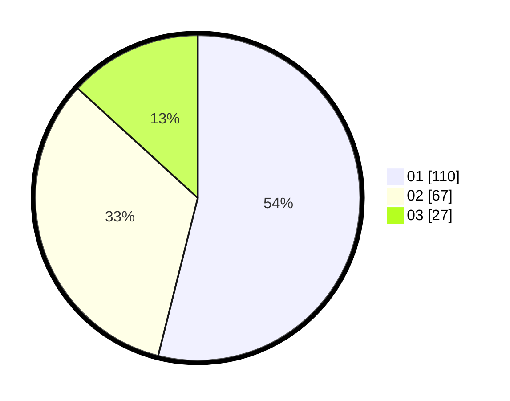

# Hasil

Hasil perolehan suara paslon dapat dilihat pada file paslon-01.txt, paslon-02.txt, dan paslon-03.txt.

Jika tidak ada, artinya data tersebut belum ada pada SIREKAP.

## Perolehan Suara

 * Paslon 01: **110**.
 * Paslon 02: **67**.
 * Paslon 03: **27**.

## Foto C Plano

https://sirekap-obj-formc.kpu.go.id/16c0/pemilu/ppwp/31/75/03/10/08/3175031008046-20240215-132656--829beacf-b3e3-450a-bc1a-64fb8b8b2e87.jpg

https://sirekap-obj-formc.kpu.go.id/16c0/pemilu/ppwp/31/75/03/10/08/3175031008046-20240215-020838--d087170d-a124-4643-8877-d5dec96ab219.jpg

https://sirekap-obj-formc.kpu.go.id/16c0/pemilu/ppwp/31/75/03/10/08/3175031008046-20240215-021337--6ba75cf0-4162-4c5f-8ec7-351bba37faa8.jpg
