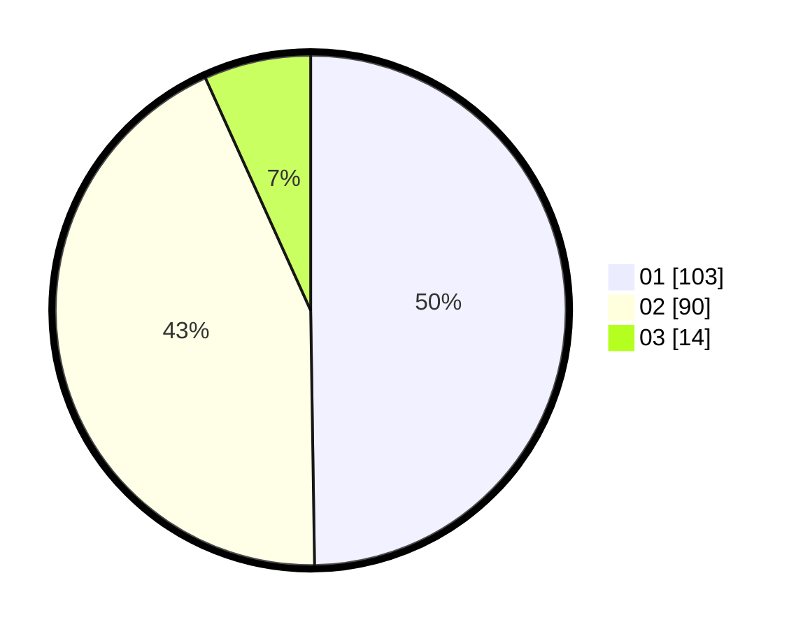

# Hasil

Hasil perolehan suara paslon dapat dilihat pada file paslon-01.txt, paslon-02.txt, dan paslon-03.txt.

Jika tidak ada, artinya data tersebut belum ada pada SIREKAP.

## Perolehan Suara

 * Paslon 01: **103**.
 * Paslon 02: **90**.
 * Paslon 03: **14**.

## Foto C Plano

https://sirekap-obj-formc.kpu.go.id/7b1c/pemilu/ppwp/31/75/03/10/08/3175031008047-20240214-235114--577be989-7a51-4c2c-94be-9504d3f6274e.jpg

https://sirekap-obj-formc.kpu.go.id/7b1c/pemilu/ppwp/31/75/03/10/08/3175031008047-20240214-235202--056a7fff-ae86-49d8-9a87-bfe94c1b16af.jpg

https://sirekap-obj-formc.kpu.go.id/7b1c/pemilu/ppwp/31/75/03/10/08/3175031008047-20240214-235218--e88079c8-74ac-434d-9ebb-76b8b4f12382.jpg
