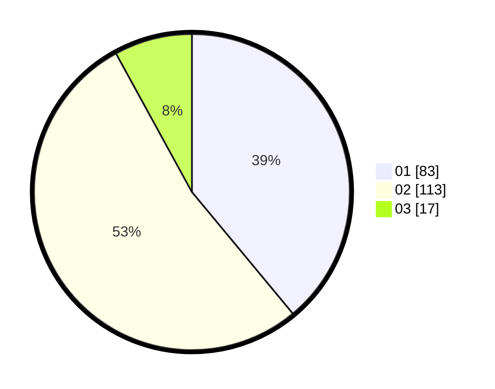

# Hasil

Hasil perolehan suara paslon dapat dilihat pada file paslon-01.txt, paslon-02.txt, dan paslon-03.txt.

Jika tidak ada, artinya data tersebut belum ada pada SIREKAP.

## Perolehan Suara

 * Paslon 01: **83**.
 * Paslon 02: **113**.
 * Paslon 03: **17**.

## Foto C Plano

https://sirekap-obj-formc.kpu.go.id/4145/pemilu/ppwp/31/75/03/10/08/3175031008054-20240214-194342--2bf384b7-e25a-47d0-b8b3-dc922e768e02.jpg

https://sirekap-obj-formc.kpu.go.id/4145/pemilu/ppwp/31/75/03/10/08/3175031008054-20240214-194345--b339e993-b285-4e1b-ab28-e588deb18f18.jpg

https://sirekap-obj-formc.kpu.go.id/4145/pemilu/ppwp/31/75/03/10/08/3175031008054-20240214-194350--e9c916a5-22eb-43fe-aad2-3b60daac7bfc.jpg

## DATA PEMILIH TETAP

Jumlah pemilih dalam DPT: **271**.
 * L: **144**.
 * P: **127**.

## DATA PENGGUNA HAK PILIH

Jumlah pengguna hak pilih dalam DPT: **216**.
 * L: **118**.
 * P: **98**.

Jumlah pengguna hak pilih dalam DPTb: **0**.
 * L: **0**.
 * P: **0**.

Jumlah pengguna hak pilih dalam DPK: **1**.
 * L: **0**.
 * P: **1**.

Jumlah pengguna hak pilih: **217**.
 * L: **118**.
 * P: **99**.

## JUMLAH SUARA SAH DAN TIDAK SAH

JUMLAH SELURUH SUARA SAH: **213**.

JUMLAH SUARA TIDAK SAH: **6**.

JUMLAH SELURUH SUARA SAH DAN SUARA TIDAK SAH: **219**.
