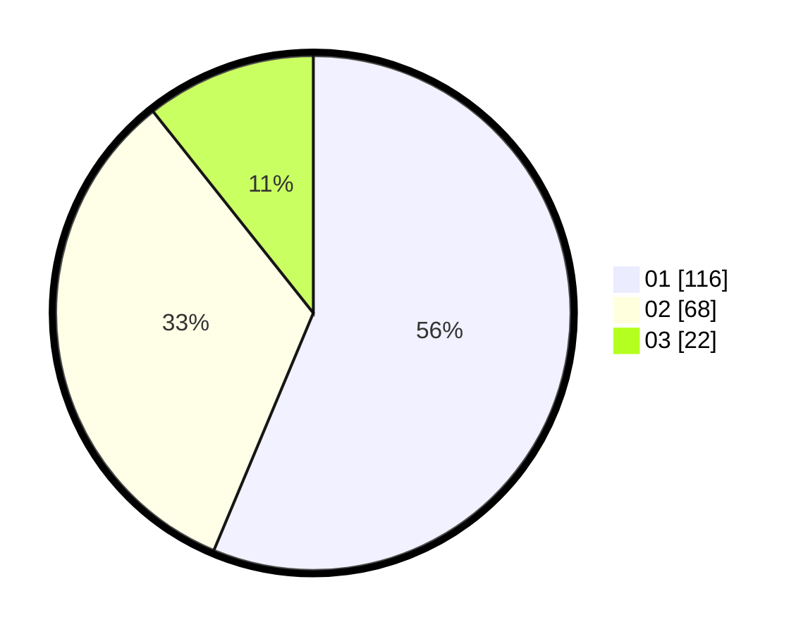

# Hasil

Hasil perolehan suara paslon dapat dilihat pada file paslon-01.txt, paslon-02.txt, dan paslon-03.txt.

Jika tidak ada, artinya data tersebut belum ada pada SIREKAP.

## Perolehan Suara

 * Paslon 01: **116**.
 * Paslon 02: **68**.
 * Paslon 03: **22**.

## Foto C Plano

https://sirekap-obj-formc.kpu.go.id/e23d/pemilu/ppwp/31/75/03/10/08/3175031008059-20240214-212216--fb384271-fade-478d-b8ad-d682ced0deaf.jpg

https://sirekap-obj-formc.kpu.go.id/e23d/pemilu/ppwp/31/75/03/10/08/3175031008059-20240214-204229--c4e391e2-1069-4bde-9f4e-83920d2e6d2b.jpg

https://sirekap-obj-formc.kpu.go.id/e23d/pemilu/ppwp/31/75/03/10/08/3175031008059-20240214-204338--c5b959fe-94f3-40a4-a3f9-d6d9dfe0d802.jpg

## DATA PEMILIH TETAP

Jumlah pemilih dalam DPT: **270**.
 * L: **144**.
 * P: **126**.

## DATA PENGGUNA HAK PILIH

Jumlah pengguna hak pilih dalam DPT: **212**.
 * L: **114**.
 * P: **98**.

Jumlah pengguna hak pilih dalam DPTb: **0**.
 * L: **0**.
 * P: **0**.

Jumlah pengguna hak pilih dalam DPK: **0**.
 * L: **0**.
 * P: **0**.

Jumlah pengguna hak pilih: **212**.
 * L: **114**.
 * P: **98**.

## JUMLAH SUARA SAH DAN TIDAK SAH

JUMLAH SELURUH SUARA SAH: **206**.

JUMLAH SUARA TIDAK SAH: **6**.

JUMLAH SELURUH SUARA SAH DAN SUARA TIDAK SAH: **212**.
