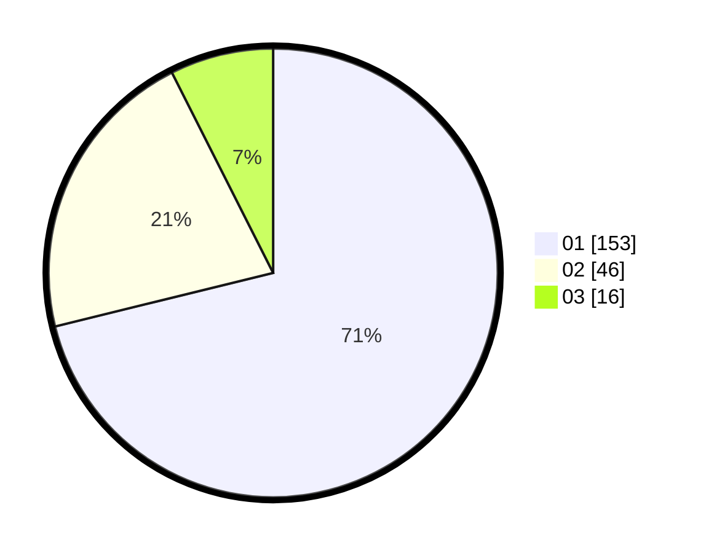

# Hasil

Hasil perolehan suara paslon dapat dilihat pada file paslon-01.txt, paslon-02.txt, dan paslon-03.txt.

Jika tidak ada, artinya data tersebut belum ada pada SIREKAP.

## Perolehan Suara

 * Paslon 01: **153**.
 * Paslon 02: **46**.
 * Paslon 03: **16**.

## Foto C Plano

https://sirekap-obj-formc.kpu.go.id/b899/pemilu/ppwp/31/75/03/10/08/3175031008061-20240215-201218--654cc0c6-9d0e-43cb-97dc-c9397f708340.jpg

https://sirekap-obj-formc.kpu.go.id/b899/pemilu/ppwp/31/75/03/10/08/3175031008061-20240215-201243--0df33305-178f-4671-bc69-a240847aa2bd.jpg

https://sirekap-obj-formc.kpu.go.id/b899/pemilu/ppwp/31/75/03/10/08/3175031008061-20240215-201230--01792e02-ebdb-445e-9e5d-0d82dc315431.jpg

## DATA PEMILIH TETAP

Jumlah pemilih dalam DPT: **272**.
 * L: **131**.
 * P: **141**.

## DATA PENGGUNA HAK PILIH

Jumlah pengguna hak pilih dalam DPT: **217**.
 * L: **101**.
 * P: **116**.

Jumlah pengguna hak pilih dalam DPTb: **0**.
 * L: **0**.
 * P: **0**.

Jumlah pengguna hak pilih dalam DPK: **0**.
 * L: **0**.
 * P: **0**.

Jumlah pengguna hak pilih: **217**.
 * L: **101**.
 * P: **116**.

## JUMLAH SUARA SAH DAN TIDAK SAH

JUMLAH SELURUH SUARA SAH: **215**.

JUMLAH SUARA TIDAK SAH: **2**.

JUMLAH SELURUH SUARA SAH DAN SUARA TIDAK SAH: **217**.
