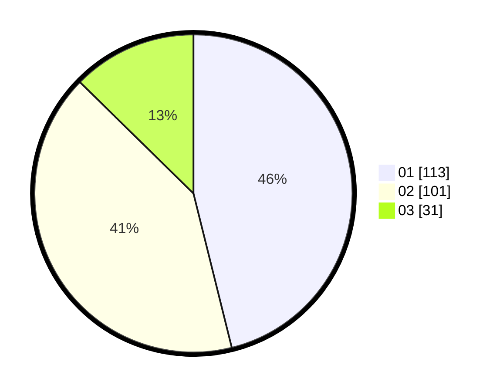

# Hasil

Hasil perolehan suara paslon dapat dilihat pada file paslon-01.txt, paslon-02.txt, dan paslon-03.txt.

Jika tidak ada, artinya data tersebut belum ada pada SIREKAP.

## Perolehan Suara

 * Paslon 01: **113**.
 * Paslon 02: **101**.
 * Paslon 03: **31**.

## Foto C Plano

https://sirekap-obj-formc.kpu.go.id/35e8/pemilu/ppwp/31/75/03/10/08/3175031008069-20240216-102338--4ebc36c2-31f8-470e-a15a-6ad898462483.jpg

https://sirekap-obj-formc.kpu.go.id/35e8/pemilu/ppwp/31/75/03/10/08/3175031008069-20240216-102339--3b9654f8-c7d0-4c1a-9f2f-9d67d3dfc14b.jpg

https://sirekap-obj-formc.kpu.go.id/35e8/pemilu/ppwp/31/75/03/10/08/3175031008069-20240216-102338--3f7003b6-64de-4cb5-b2c5-d1a9564b4abc.jpg

## DATA PEMILIH TETAP

Jumlah pemilih dalam DPT: **293**.
 * L: **147**.
 * P: **146**.

## DATA PENGGUNA HAK PILIH

Jumlah pengguna hak pilih dalam DPT: **243**.
 * L: **117**.
 * P: **126**.

Jumlah pengguna hak pilih dalam DPTb: **1**.
 * L: **1**.
 * P: **0**.

Jumlah pengguna hak pilih dalam DPK: **1**.
 * L: **1**.
 * P: **0**.

Jumlah pengguna hak pilih: **245**.
 * L: **119**.
 * P: **126**.

## JUMLAH SUARA SAH DAN TIDAK SAH

JUMLAH SELURUH SUARA SAH: **245**.

JUMLAH SUARA TIDAK SAH: **0**.

JUMLAH SELURUH SUARA SAH DAN SUARA TIDAK SAH: **245**.
