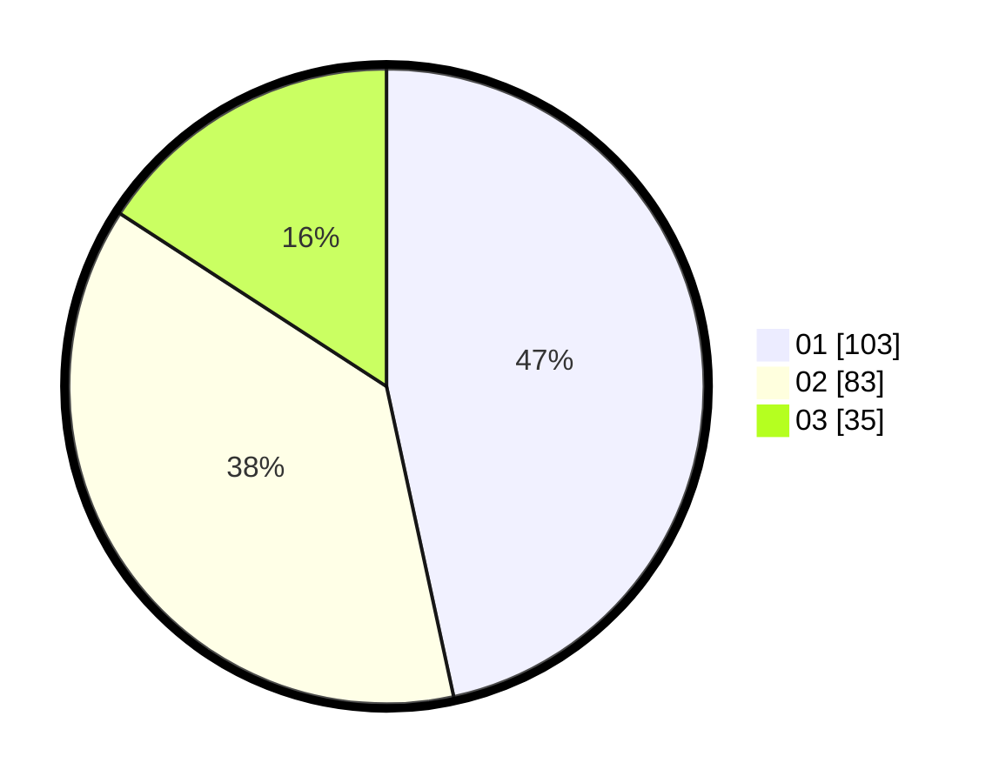

# Hasil

Hasil perolehan suara paslon dapat dilihat pada file paslon-01.txt, paslon-02.txt, dan paslon-03.txt.

Jika tidak ada, artinya data tersebut belum ada pada SIREKAP.

## Perolehan Suara

 * Paslon 01: **103**.
 * Paslon 02: **83**.
 * Paslon 03: **35**.

## Foto C Plano

https://sirekap-obj-formc.kpu.go.id/8a9f/pemilu/ppwp/31/75/03/10/08/3175031008072-20240214-155017--aed0ca63-a564-4144-9a9a-8ff3883fa26e.jpg

https://sirekap-obj-formc.kpu.go.id/8a9f/pemilu/ppwp/31/75/03/10/08/3175031008072-20240214-155107--9a301dd6-701f-4112-b0eb-87ef0b50953f.jpg

https://sirekap-obj-formc.kpu.go.id/8a9f/pemilu/ppwp/31/75/03/10/08/3175031008072-20240214-155244--7f9a805c-9f74-4fa1-8c71-362bd3ab723f.jpg

## DATA PEMILIH TETAP

Jumlah pemilih dalam DPT: **296**.
 * L: **150**.
 * P: **146**.

## DATA PENGGUNA HAK PILIH

Jumlah pengguna hak pilih dalam DPT: **225**.
 * L: **112**.
 * P: **113**.

Jumlah pengguna hak pilih dalam DPTb: **1**.
 * L: **1**.
 * P: **0**.

Jumlah pengguna hak pilih dalam DPK: **0**.
 * L: **0**.
 * P: **0**.

Jumlah pengguna hak pilih: **226**.
 * L: **113**.
 * P: **113**.

## JUMLAH SUARA SAH DAN TIDAK SAH

JUMLAH SELURUH SUARA SAH: **221**.

JUMLAH SUARA TIDAK SAH: **5**.

JUMLAH SELURUH SUARA SAH DAN SUARA TIDAK SAH: **226**.
