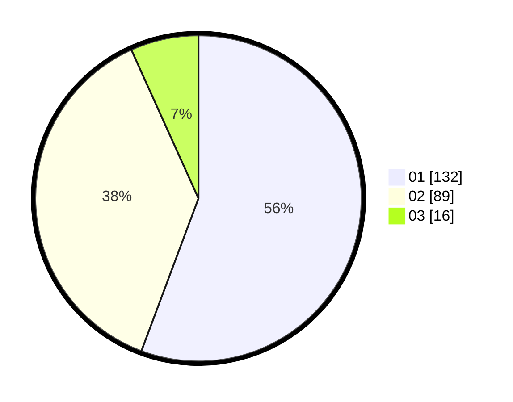

# Hasil

Hasil perolehan suara paslon dapat dilihat pada file paslon-01.txt, paslon-02.txt, dan paslon-03.txt.

Jika tidak ada, artinya data tersebut belum ada pada SIREKAP.

## Perolehan Suara

 * Paslon 01: **132**.
 * Paslon 02: **89**.
 * Paslon 03: **16**.

## Foto C Plano

https://sirekap-obj-formc.kpu.go.id/024b/pemilu/ppwp/31/75/03/10/08/3175031008073-20240216-142015--a489208f-1dfb-4a3a-8fa2-844236644a13.jpg

https://sirekap-obj-formc.kpu.go.id/024b/pemilu/ppwp/31/75/03/10/08/3175031008073-20240216-142016--c2f0a214-80eb-47aa-a3bd-217038008a4c.jpg

https://sirekap-obj-formc.kpu.go.id/024b/pemilu/ppwp/31/75/03/10/08/3175031008073-20240216-142016--954ce18e-52e8-4c33-a5e1-adb718296db4.jpg

## DATA PEMILIH TETAP

Jumlah pemilih dalam DPT: **298**.
 * L: **155**.
 * P: **143**.

## DATA PENGGUNA HAK PILIH

Jumlah pengguna hak pilih dalam DPT: **240**.
 * L: **116**.
 * P: **124**.

Jumlah pengguna hak pilih dalam DPTb: **0**.
 * L: **0**.
 * P: **0**.

Jumlah pengguna hak pilih dalam DPK: **0**.
 * L: **0**.
 * P: **0**.

Jumlah pengguna hak pilih: **240**.
 * L: **116**.
 * P: **124**.

## JUMLAH SUARA SAH DAN TIDAK SAH

JUMLAH SELURUH SUARA SAH: **237**.

JUMLAH SUARA TIDAK SAH: **3**.

JUMLAH SELURUH SUARA SAH DAN SUARA TIDAK SAH: **240**.
