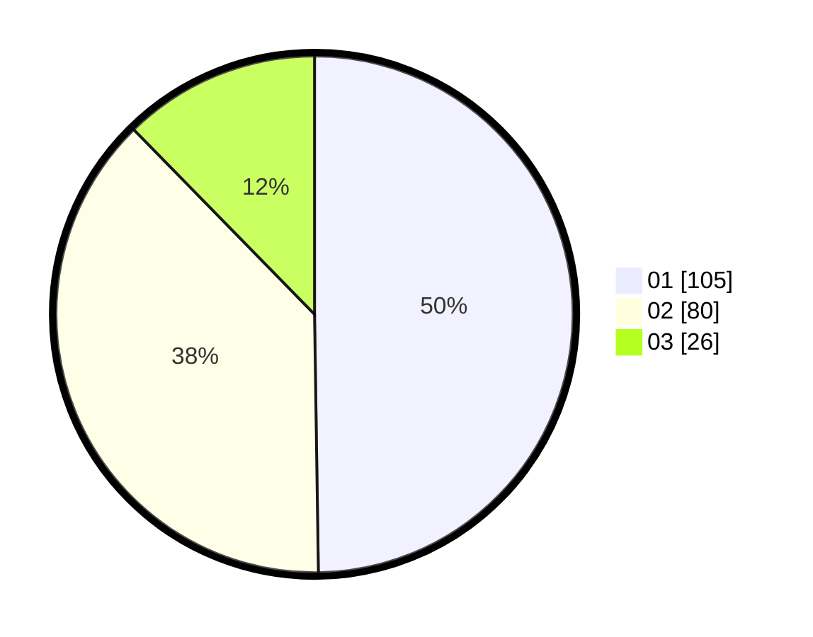

# Hasil

Hasil perolehan suara paslon dapat dilihat pada file paslon-01.txt, paslon-02.txt, dan paslon-03.txt.

Jika tidak ada, artinya data tersebut belum ada pada SIREKAP.

## Perolehan Suara

 * Paslon 01: **105**.
 * Paslon 02: **80**.
 * Paslon 03: **26**.

## Foto C Plano

https://sirekap-obj-formc.kpu.go.id/c269/pemilu/ppwp/31/75/03/10/08/3175031008075-20240214-193853--9a347fa6-3b79-4f7e-b443-f482187ca3bb.jpg

https://sirekap-obj-formc.kpu.go.id/c269/pemilu/ppwp/31/75/03/10/08/3175031008075-20240215-000840--a102da02-bee8-4b93-9dd3-6fbaccb4c09f.jpg

https://sirekap-obj-formc.kpu.go.id/c269/pemilu/ppwp/31/75/03/10/08/3175031008075-20240214-193634--d558a88c-4bed-4f5e-af00-69c60787c144.jpg
