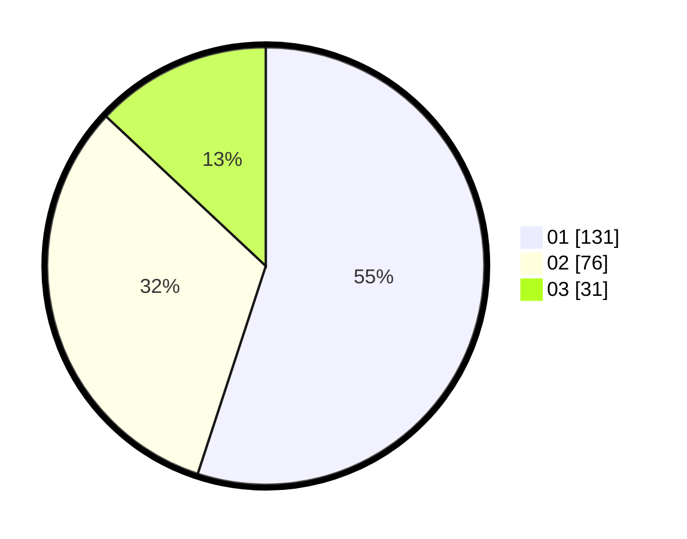

# Hasil

Hasil perolehan suara paslon dapat dilihat pada file paslon-01.txt, paslon-02.txt, dan paslon-03.txt.

Jika tidak ada, artinya data tersebut belum ada pada SIREKAP.

## Perolehan Suara

 * Paslon 01: **131**.
 * Paslon 02: **76**.
 * Paslon 03: **31**.

## Foto C Plano

https://sirekap-obj-formc.kpu.go.id/954c/pemilu/ppwp/31/75/03/10/08/3175031008079-20240216-082341--25997499-482d-4598-998d-5ffb335265e7.jpg

https://sirekap-obj-formc.kpu.go.id/954c/pemilu/ppwp/31/75/03/10/08/3175031008079-20240216-090652--b3dcbb52-f95e-4f92-a946-9efec6e78a4e.jpg

https://sirekap-obj-formc.kpu.go.id/954c/pemilu/ppwp/31/75/03/10/08/3175031008079-20240216-082343--eaa83d0f-f27d-4731-9f2b-0fb02250d690.jpg

## DATA PEMILIH TETAP

Jumlah pemilih dalam DPT: **291**.
 * L: **146**.
 * P: **145**.

## DATA PENGGUNA HAK PILIH

Jumlah pengguna hak pilih dalam DPT: **229**.
 * L: **111**.
 * P: **118**.

Jumlah pengguna hak pilih dalam DPTb: **7**.
 * L: **1**.
 * P: **6**.

Jumlah pengguna hak pilih dalam DPK: **4**.
 * L: **1**.
 * P: **3**.

Jumlah pengguna hak pilih: **240**.
 * L: **113**.
 * P: **127**.

## JUMLAH SUARA SAH DAN TIDAK SAH

JUMLAH SELURUH SUARA SAH: **238**.

JUMLAH SUARA TIDAK SAH: **2**.

JUMLAH SELURUH SUARA SAH DAN SUARA TIDAK SAH: **240**.
