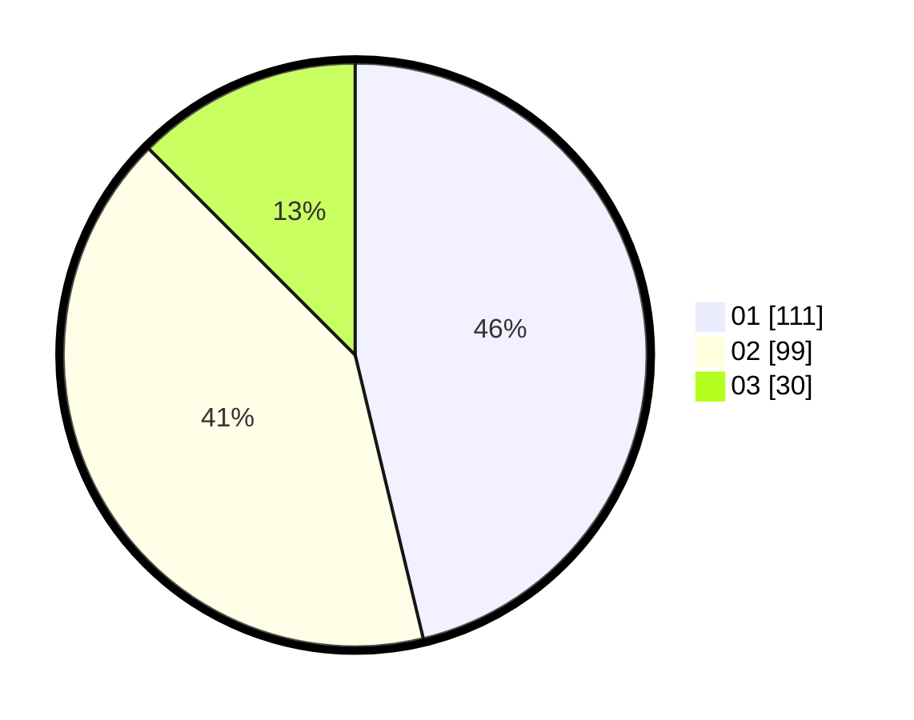

# Hasil

Hasil perolehan suara paslon dapat dilihat pada file paslon-01.txt, paslon-02.txt, dan paslon-03.txt.

Jika tidak ada, artinya data tersebut belum ada pada SIREKAP.

## Perolehan Suara

 * Paslon 01: **111**.
 * Paslon 02: **99**.
 * Paslon 03: **30**.

## Foto C Plano

https://sirekap-obj-formc.kpu.go.id/c4db/pemilu/ppwp/31/75/03/10/08/3175031008082-20240214-155034--dcd330d8-66b8-4f83-bc60-a1618810c733.jpg

https://sirekap-obj-formc.kpu.go.id/c4db/pemilu/ppwp/31/75/03/10/08/3175031008082-20240214-155521--b467b377-c5c3-41de-9477-ecc50186906a.jpg

https://sirekap-obj-formc.kpu.go.id/c4db/pemilu/ppwp/31/75/03/10/08/3175031008082-20240214-155615--121977b8-61f5-48e7-a725-0e2a33cc9370.jpg

## DATA PEMILIH TETAP

Jumlah pemilih dalam DPT: **242**.
 * L: **117**.
 * P: **125**.

## DATA PENGGUNA HAK PILIH

Jumlah pengguna hak pilih dalam DPT: **242**.
 * L: **117**.
 * P: **125**.

Jumlah pengguna hak pilih dalam DPTb: **0**.
 * L: **0**.
 * P: **0**.

Jumlah pengguna hak pilih dalam DPK: **2**.
 * L: **0**.
 * P: **2**.

Jumlah pengguna hak pilih: **244**.
 * L: **117**.
 * P: **127**.

## JUMLAH SUARA SAH DAN TIDAK SAH

JUMLAH SELURUH SUARA SAH: **240**.

JUMLAH SUARA TIDAK SAH: **4**.

JUMLAH SELURUH SUARA SAH DAN SUARA TIDAK SAH: **244**.
