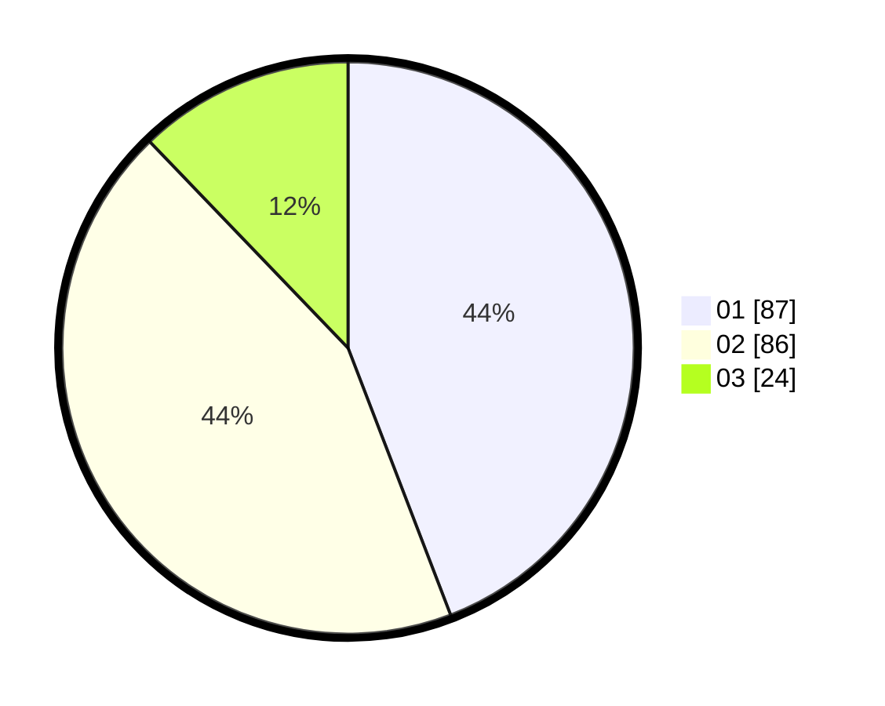

# Hasil

Hasil perolehan suara paslon dapat dilihat pada file paslon-01.txt, paslon-02.txt, dan paslon-03.txt.

Jika tidak ada, artinya data tersebut belum ada pada SIREKAP.

## Perolehan Suara

 * Paslon 01: **87**.
 * Paslon 02: **86**.
 * Paslon 03: **24**.

## Foto C Plano

https://sirekap-obj-formc.kpu.go.id/0bf0/pemilu/ppwp/31/75/03/10/08/3175031008084-20240214-162238--bf74e035-ac34-43e4-8840-adcf4d1dc7e1.jpg

https://sirekap-obj-formc.kpu.go.id/0bf0/pemilu/ppwp/31/75/03/10/08/3175031008084-20240214-155437--4bddfcf5-d5a3-4b9c-80e1-925fba03f4a8.jpg

https://sirekap-obj-formc.kpu.go.id/0bf0/pemilu/ppwp/31/75/03/10/08/3175031008084-20240214-155313--ec36ecfb-3bbd-41f9-a6f7-bef3e8725ef1.jpg

## DATA PEMILIH TETAP

Jumlah pemilih dalam DPT: **264**.
 * L: **139**.
 * P: **125**.

## DATA PENGGUNA HAK PILIH

Jumlah pengguna hak pilih dalam DPT: **203**.
 * L: **105**.
 * P: **98**.

Jumlah pengguna hak pilih dalam DPTb: **0**.
 * L: **0**.
 * P: **0**.

Jumlah pengguna hak pilih dalam DPK: **0**.
 * L: **0**.
 * P: **0**.

Jumlah pengguna hak pilih: **203**.
 * L: **105**.
 * P: **98**.

## JUMLAH SUARA SAH DAN TIDAK SAH

JUMLAH SELURUH SUARA SAH: **197**.

JUMLAH SUARA TIDAK SAH: **6**.

JUMLAH SELURUH SUARA SAH DAN SUARA TIDAK SAH: **203**.
