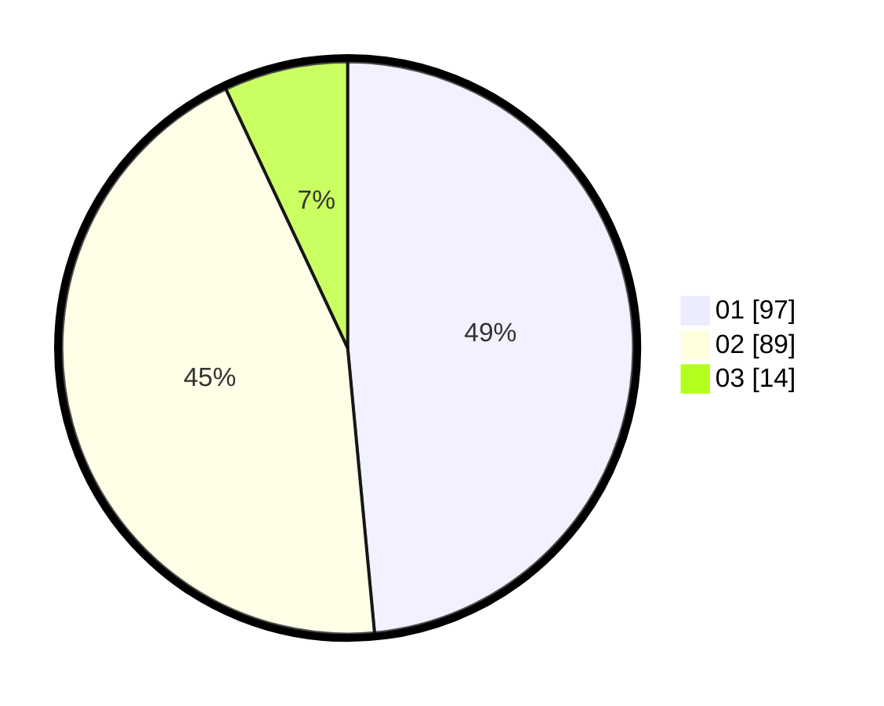

# Hasil

Hasil perolehan suara paslon dapat dilihat pada file paslon-01.txt, paslon-02.txt, dan paslon-03.txt.

Jika tidak ada, artinya data tersebut belum ada pada SIREKAP.

## Perolehan Suara

 * Paslon 01: **97**.
 * Paslon 02: **89**.
 * Paslon 03: **14**.

## Foto C Plano

https://sirekap-obj-formc.kpu.go.id/f4ad/pemilu/ppwp/31/75/03/10/08/3175031008085-20240214-155212--8e46f793-3f1f-4cd5-91a8-5599371730f9.jpg

https://sirekap-obj-formc.kpu.go.id/f4ad/pemilu/ppwp/31/75/03/10/08/3175031008085-20240214-155219--3980c5c6-31cd-49bf-a358-d138f9a7c383.jpg

https://sirekap-obj-formc.kpu.go.id/f4ad/pemilu/ppwp/31/75/03/10/08/3175031008085-20240215-210719--93b0ff2e-a512-4a76-9614-9078fb6f8e63.jpg

## DATA PEMILIH TETAP

Jumlah pemilih dalam DPT: **271**.
 * L: **136**.
 * P: **135**.

## DATA PENGGUNA HAK PILIH

Jumlah pengguna hak pilih dalam DPT: **197**.
 * L: **96**.
 * P: **101**.

Jumlah pengguna hak pilih dalam DPTb: **4**.
 * L: **2**.
 * P: **2**.

Jumlah pengguna hak pilih dalam DPK: **0**.
 * L: **0**.
 * P: **0**.

Jumlah pengguna hak pilih: **201**.
 * L: **98**.
 * P: **103**.

## JUMLAH SUARA SAH DAN TIDAK SAH

JUMLAH SELURUH SUARA SAH: **200**.

JUMLAH SUARA TIDAK SAH: **1**.

JUMLAH SELURUH SUARA SAH DAN SUARA TIDAK SAH: **201**.
