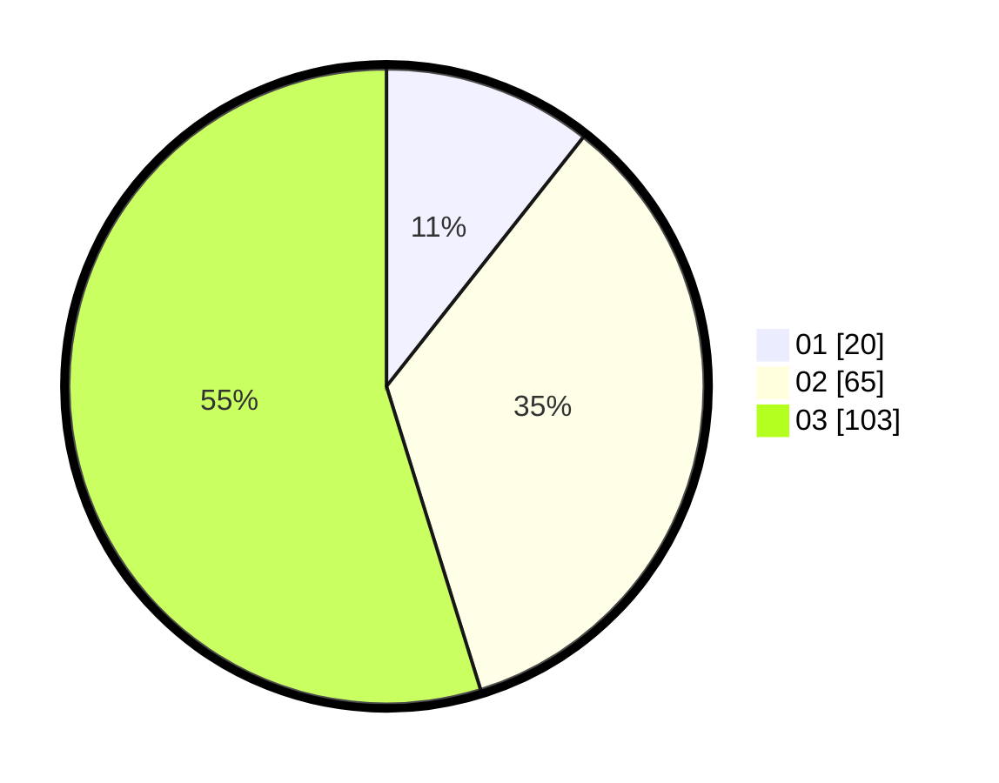

# Hasil

Hasil perolehan suara paslon dapat dilihat pada file paslon-01.txt, paslon-02.txt, dan paslon-03.txt.

Jika tidak ada, artinya data tersebut belum ada pada SIREKAP.

## Perolehan Suara

 * Paslon 01: **20**.
 * Paslon 02: **65**.
 * Paslon 03: **103**.

## Foto C Plano

https://sirekap-obj-formc.kpu.go.id/6b22/pemilu/ppwp/31/75/03/10/08/3175031008088-20240214-191353--4f6b17a4-87b0-40ae-9c21-14467b71a406.jpg

https://sirekap-obj-formc.kpu.go.id/6b22/pemilu/ppwp/31/75/03/10/08/3175031008088-20240214-191356--4eb34de9-3d81-4635-b923-fc9e3a14dfac.jpg

https://sirekap-obj-formc.kpu.go.id/6b22/pemilu/ppwp/31/75/03/10/08/3175031008088-20240214-191400--532e79c4-a11c-4d6f-8682-2d1494d671c3.jpg

## DATA PEMILIH TETAP

Jumlah pemilih dalam DPT: **267**.
 * L: **123**.
 * P: **144**.

## DATA PENGGUNA HAK PILIH

Jumlah pengguna hak pilih dalam DPT: **187**.
 * L: **82**.
 * P: **105**.

Jumlah pengguna hak pilih dalam DPTb: **2**.
 * L: **0**.
 * P: **2**.

Jumlah pengguna hak pilih dalam DPK: **0**.
 * L: **0**.
 * P: **0**.

Jumlah pengguna hak pilih: **189**.
 * L: **82**.
 * P: **107**.

## JUMLAH SUARA SAH DAN TIDAK SAH

JUMLAH SELURUH SUARA SAH: **188**.

JUMLAH SUARA TIDAK SAH: **1**.

JUMLAH SELURUH SUARA SAH DAN SUARA TIDAK SAH: **189**.
