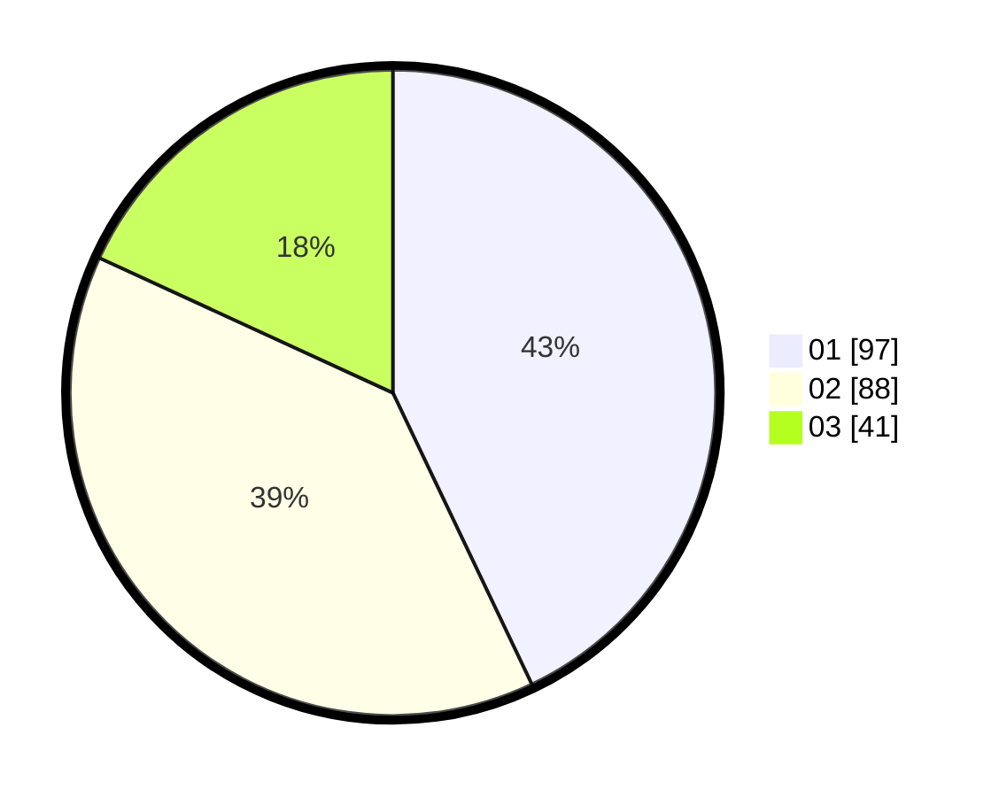

# Hasil

Hasil perolehan suara paslon dapat dilihat pada file paslon-01.txt, paslon-02.txt, dan paslon-03.txt.

Jika tidak ada, artinya data tersebut belum ada pada SIREKAP.

## Perolehan Suara

 * Paslon 01: **97**.
 * Paslon 02: **88**.
 * Paslon 03: **41**.

## Foto C Plano

https://sirekap-obj-formc.kpu.go.id/b140/pemilu/ppwp/31/75/03/10/08/3175031008089-20240214-155436--fc82bbcc-7166-42ad-a12c-c68d6de8b28d.jpg

https://sirekap-obj-formc.kpu.go.id/b140/pemilu/ppwp/31/75/03/10/08/3175031008089-20240214-155538--9b63e3ee-5874-4b52-8653-377ac22e1f9f.jpg

https://sirekap-obj-formc.kpu.go.id/b140/pemilu/ppwp/31/75/03/10/08/3175031008089-20240214-155301--a3a138d4-6bfe-4e7d-b1bf-1c06c7eb6420.jpg

## DATA PEMILIH TETAP

Jumlah pemilih dalam DPT: **269**.
 * L: **132**.
 * P: **137**.

## DATA PENGGUNA HAK PILIH

Jumlah pengguna hak pilih dalam DPT: **222**.
 * L: **108**.
 * P: **114**.

Jumlah pengguna hak pilih dalam DPTb: **3**.
 * L: **1**.
 * P: **2**.

Jumlah pengguna hak pilih dalam DPK: **3**.
 * L: **2**.
 * P: **1**.

Jumlah pengguna hak pilih: **228**.
 * L: **111**.
 * P: **117**.

## JUMLAH SUARA SAH DAN TIDAK SAH

JUMLAH SELURUH SUARA SAH: **226**.

JUMLAH SUARA TIDAK SAH: **2**.

JUMLAH SELURUH SUARA SAH DAN SUARA TIDAK SAH: **228**.
