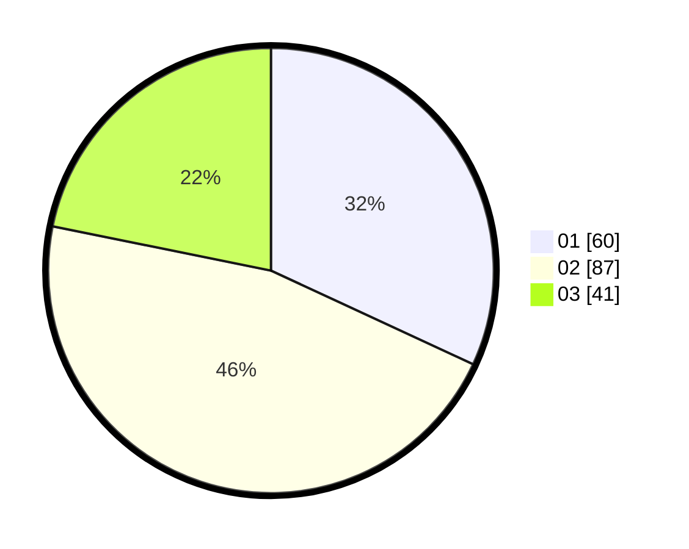

# Hasil

Hasil perolehan suara paslon dapat dilihat pada file paslon-01.txt, paslon-02.txt, dan paslon-03.txt.

Jika tidak ada, artinya data tersebut belum ada pada SIREKAP.

## Perolehan Suara

 * Paslon 01: **60**.
 * Paslon 02: **87**.
 * Paslon 03: **41**.

## Foto C Plano

https://sirekap-obj-formc.kpu.go.id/eb7f/pemilu/ppwp/31/75/03/10/08/3175031008091-20240214-231719--a83824e8-c41d-404b-a498-4479bb51f8fe.jpg

https://sirekap-obj-formc.kpu.go.id/eb7f/pemilu/ppwp/31/75/03/10/08/3175031008091-20240216-073813--e4e659bd-35b9-43c6-8b7c-2605bf98b7f6.jpg

https://sirekap-obj-formc.kpu.go.id/eb7f/pemilu/ppwp/31/75/03/10/08/3175031008091-20240216-073804--1550fff7-022d-4a33-9041-6b0b223f847a.jpg

## DATA PEMILIH TETAP

Jumlah pemilih dalam DPT: **265**.
 * L: **128**.
 * P: **137**.

## DATA PENGGUNA HAK PILIH

Jumlah pengguna hak pilih dalam DPT: **204**.
 * L: **95**.
 * P: **109**.

Jumlah pengguna hak pilih dalam DPTb: **0**.
 * L: **0**.
 * P: **0**.

Jumlah pengguna hak pilih dalam DPK: **0**.
 * L: **0**.
 * P: **0**.

Jumlah pengguna hak pilih: **204**.
 * L: **95**.
 * P: **109**.

## JUMLAH SUARA SAH DAN TIDAK SAH

JUMLAH SELURUH SUARA SAH: **188**.

JUMLAH SUARA TIDAK SAH: **16**.

JUMLAH SELURUH SUARA SAH DAN SUARA TIDAK SAH: **204**.
