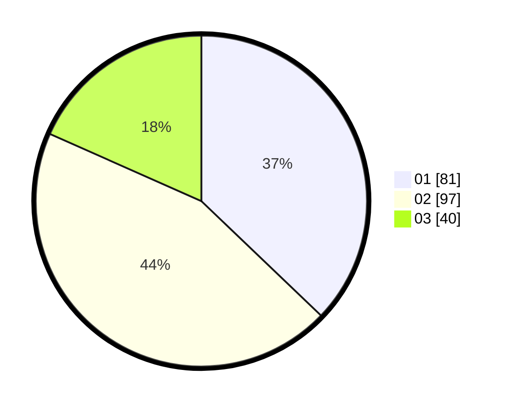

# Hasil

Hasil perolehan suara paslon dapat dilihat pada file paslon-01.txt, paslon-02.txt, dan paslon-03.txt.

Jika tidak ada, artinya data tersebut belum ada pada SIREKAP.

## Perolehan Suara

 * Paslon 01: **81**.
 * Paslon 02: **97**.
 * Paslon 03: **40**.

## Foto C Plano

https://sirekap-obj-formc.kpu.go.id/5055/pemilu/ppwp/31/75/03/10/08/3175031008092-20240215-190238--3e29527d-4d50-4d94-a732-a3e4b8e5a9b8.jpg

https://sirekap-obj-formc.kpu.go.id/5055/pemilu/ppwp/31/75/03/10/08/3175031008092-20240215-190259--a84ffe8e-491d-494f-bf7c-70caff3a1bba.jpg

https://sirekap-obj-formc.kpu.go.id/5055/pemilu/ppwp/31/75/03/10/08/3175031008092-20240215-190249--c0a21625-5cee-44e5-9ff5-e5cd0807cc6e.jpg

## DATA PEMILIH TETAP

Jumlah pemilih dalam DPT: **0**.
 * L: **0**.
 * P: **0**.

## DATA PENGGUNA HAK PILIH

Jumlah pengguna hak pilih dalam DPT: **0**.
 * L: **0**.
 * P: **0**.

Jumlah pengguna hak pilih dalam DPTb: **0**.
 * L: **0**.
 * P: **0**.

Jumlah pengguna hak pilih dalam DPK: **0**.
 * L: **0**.
 * P: **0**.

Jumlah pengguna hak pilih: **0**.
 * L: **0**.
 * P: **0**.

## JUMLAH SUARA SAH DAN TIDAK SAH

JUMLAH SELURUH SUARA SAH: **218**.

JUMLAH SUARA TIDAK SAH: **1**.

JUMLAH SELURUH SUARA SAH DAN SUARA TIDAK SAH: **219**.
