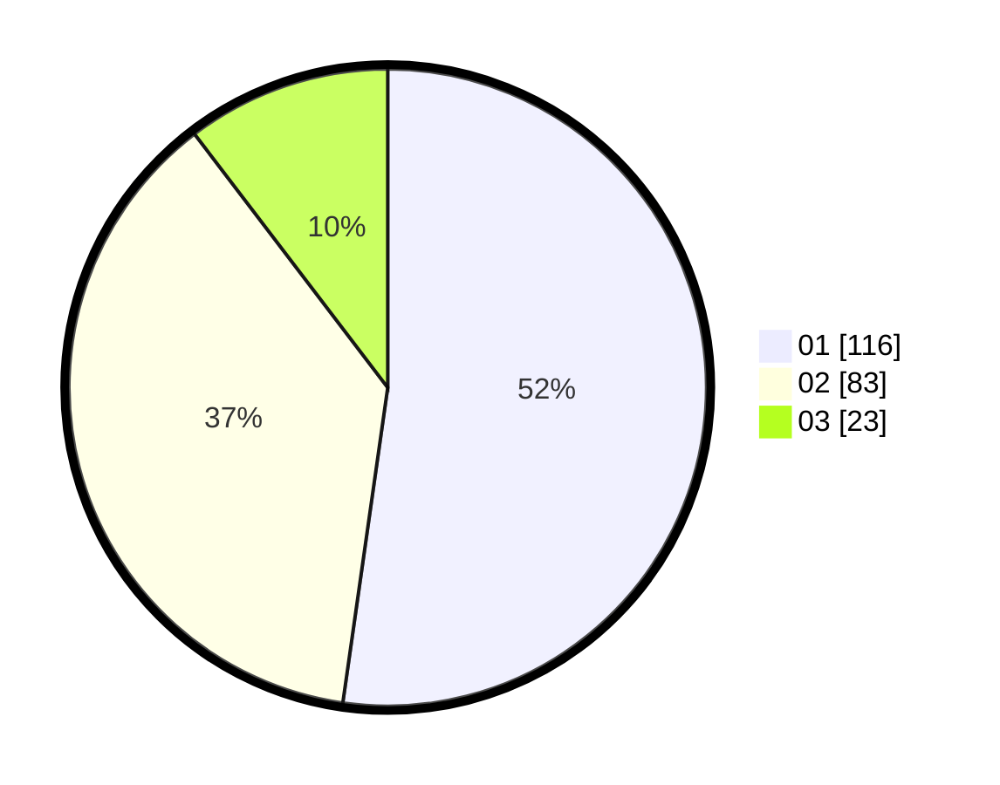

# Hasil

Hasil perolehan suara paslon dapat dilihat pada file paslon-01.txt, paslon-02.txt, dan paslon-03.txt.

Jika tidak ada, artinya data tersebut belum ada pada SIREKAP.

## Perolehan Suara

 * Paslon 01: **116**.
 * Paslon 02: **83**.
 * Paslon 03: **23**.

## Foto C Plano

https://sirekap-obj-formc.kpu.go.id/d0e3/pemilu/ppwp/31/75/03/10/08/3175031008107-20240214-192449--9e1ca330-c649-4215-b428-43f5c4f32535.jpg

https://sirekap-obj-formc.kpu.go.id/d0e3/pemilu/ppwp/31/75/03/10/08/3175031008107-20240214-192241--416920a1-3c12-422c-a86b-bbd6a9ca5b7e.jpg

https://sirekap-obj-formc.kpu.go.id/d0e3/pemilu/ppwp/31/75/03/10/08/3175031008107-20240214-192344--794525d7-91f6-41f5-9cea-2b901a081bff.jpg

## DATA PEMILIH TETAP

Jumlah pemilih dalam DPT: **272**.
 * L: **141**.
 * P: **131**.

## DATA PENGGUNA HAK PILIH

Jumlah pengguna hak pilih dalam DPT: **225**.
 * L: **109**.
 * P: **116**.

Jumlah pengguna hak pilih dalam DPTb: **0**.
 * L: **0**.
 * P: **0**.

Jumlah pengguna hak pilih dalam DPK: **0**.
 * L: **0**.
 * P: **0**.

Jumlah pengguna hak pilih: **225**.
 * L: **109**.
 * P: **116**.

## JUMLAH SUARA SAH DAN TIDAK SAH

JUMLAH SELURUH SUARA SAH: **222**.

JUMLAH SUARA TIDAK SAH: **3**.

JUMLAH SELURUH SUARA SAH DAN SUARA TIDAK SAH: **225**.
