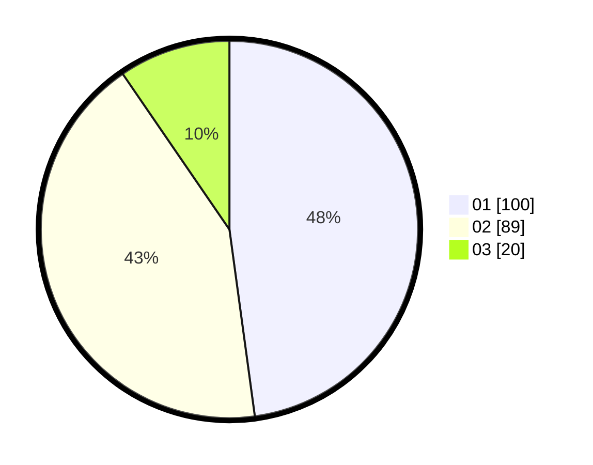

# Hasil

Hasil perolehan suara paslon dapat dilihat pada file paslon-01.txt, paslon-02.txt, dan paslon-03.txt.

Jika tidak ada, artinya data tersebut belum ada pada SIREKAP.

## Perolehan Suara

 * Paslon 01: **100**.
 * Paslon 02: **89**.
 * Paslon 03: **20**.

## Foto C Plano

https://sirekap-obj-formc.kpu.go.id/44c4/pemilu/ppwp/31/75/03/10/08/3175031008118-20240217-211242--2f8d028f-b5f5-4626-90ca-a1dbe32ba31c.jpg

https://sirekap-obj-formc.kpu.go.id/44c4/pemilu/ppwp/31/75/03/10/08/3175031008118-20240214-205724--fd810497-9175-4cef-80be-146e8ae1343d.jpg

https://sirekap-obj-formc.kpu.go.id/44c4/pemilu/ppwp/31/75/03/10/08/3175031008118-20240217-184057--e38b319a-c9bb-45fd-84ca-29092567b0ee.jpg

## DATA PEMILIH TETAP

Jumlah pemilih dalam DPT: **273**.
 * L: **138**.
 * P: **135**.

## DATA PENGGUNA HAK PILIH

Jumlah pengguna hak pilih dalam DPT: **209**.
 * L: **102**.
 * P: **107**.

Jumlah pengguna hak pilih dalam DPTb: **4**.
 * L: **0**.
 * P: **4**.

Jumlah pengguna hak pilih dalam DPK: **1**.
 * L: **1**.
 * P: **0**.

Jumlah pengguna hak pilih: **214**.
 * L: **103**.
 * P: **111**.

## JUMLAH SUARA SAH DAN TIDAK SAH

JUMLAH SELURUH SUARA SAH: **209**.

JUMLAH SUARA TIDAK SAH: **5**.

JUMLAH SELURUH SUARA SAH DAN SUARA TIDAK SAH: **214**.
