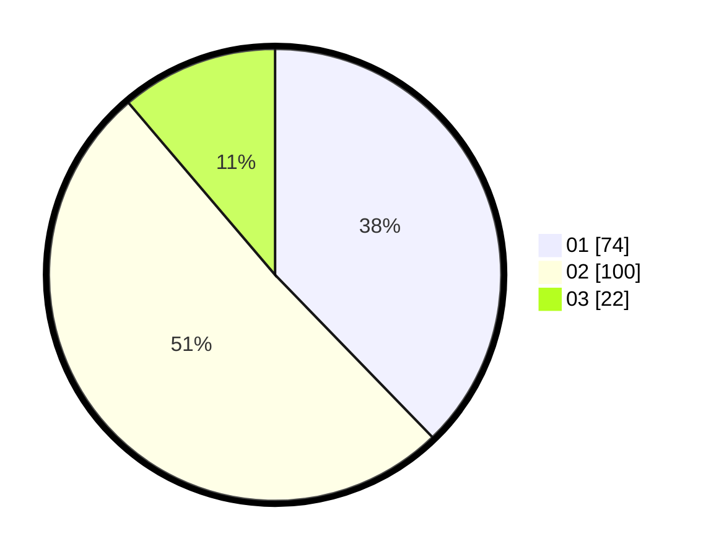

# Hasil

Hasil perolehan suara paslon dapat dilihat pada file paslon-01.txt, paslon-02.txt, dan paslon-03.txt.

Jika tidak ada, artinya data tersebut belum ada pada SIREKAP.

## Perolehan Suara

 * Paslon 01: **74**.
 * Paslon 02: **100**.
 * Paslon 03: **22**.

## Foto C Plano

https://sirekap-obj-formc.kpu.go.id/ce0f/pemilu/ppwp/31/75/03/10/08/3175031008120-20240215-014148--d4565e07-28ab-437a-994f-08c5bdbee001.jpg

https://sirekap-obj-formc.kpu.go.id/ce0f/pemilu/ppwp/31/75/03/10/08/3175031008120-20240215-014408--47fab7b5-33bd-43a9-979d-2b7c95420a45.jpg
