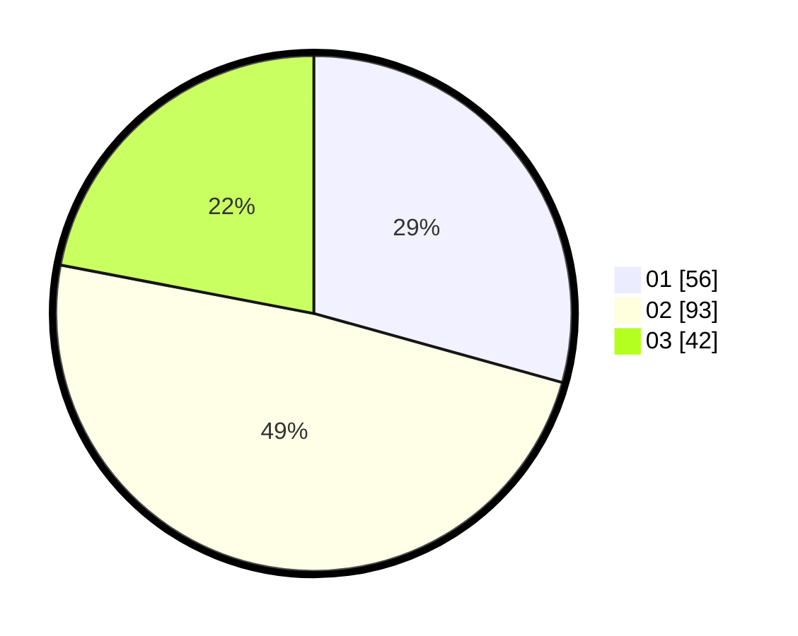

# Hasil

Hasil perolehan suara paslon dapat dilihat pada file paslon-01.txt, paslon-02.txt, dan paslon-03.txt.

Jika tidak ada, artinya data tersebut belum ada pada SIREKAP.

## Perolehan Suara

 * Paslon 01: **56**.
 * Paslon 02: **93**.
 * Paslon 03: **42**.

## Foto C Plano

https://sirekap-obj-formc.kpu.go.id/fa6f/pemilu/ppwp/31/75/03/10/08/3175031008125-20240214-155614--08f4ecd3-36b0-448c-bf21-8ffae665ce14.jpg

https://sirekap-obj-formc.kpu.go.id/fa6f/pemilu/ppwp/31/75/03/10/08/3175031008125-20240214-190753--66b9dca7-5522-42a4-a85e-e9d63fa56fd7.jpg

https://sirekap-obj-formc.kpu.go.id/fa6f/pemilu/ppwp/31/75/03/10/08/3175031008125-20240214-155459--fc475af0-9783-40e4-8197-63e2ffc8eb76.jpg

## DATA PEMILIH TETAP

Jumlah pemilih dalam DPT: **269**.
 * L: **142**.
 * P: **127**.

## DATA PENGGUNA HAK PILIH

Jumlah pengguna hak pilih dalam DPT: **192**.
 * L: **97**.
 * P: **95**.

Jumlah pengguna hak pilih dalam DPTb: **0**.
 * L: **0**.
 * P: **0**.

Jumlah pengguna hak pilih dalam DPK: **2**.
 * L: **1**.
 * P: **1**.

Jumlah pengguna hak pilih: **194**.
 * L: **98**.
 * P: **96**.

## JUMLAH SUARA SAH DAN TIDAK SAH

JUMLAH SELURUH SUARA SAH: **191**.

JUMLAH SUARA TIDAK SAH: **3**.

JUMLAH SELURUH SUARA SAH DAN SUARA TIDAK SAH: **194**.
