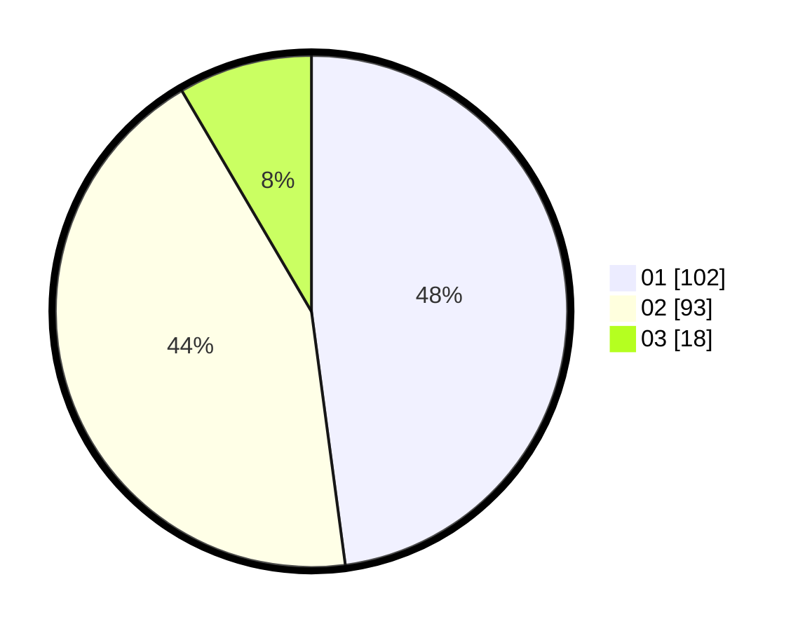

# Hasil

Hasil perolehan suara paslon dapat dilihat pada file paslon-01.txt, paslon-02.txt, dan paslon-03.txt.

Jika tidak ada, artinya data tersebut belum ada pada SIREKAP.

## Perolehan Suara

 * Paslon 01: **102**.
 * Paslon 02: **93**.
 * Paslon 03: **18**.

## Foto C Plano

https://sirekap-obj-formc.kpu.go.id/c32d/pemilu/ppwp/31/75/03/10/08/3175031008126-20240216-134502--46f6b7d4-3f7d-411f-a147-203e3438b1ac.jpg

https://sirekap-obj-formc.kpu.go.id/c32d/pemilu/ppwp/31/75/03/10/08/3175031008126-20240216-134504--2ff3311c-10c6-4784-b27a-a3839b76333f.jpg

https://sirekap-obj-formc.kpu.go.id/c32d/pemilu/ppwp/31/75/03/10/08/3175031008126-20240216-134503--7fc84726-7d07-4579-bfc0-3f6c0bf5b579.jpg

## DATA PEMILIH TETAP

Jumlah pemilih dalam DPT: **284**.
 * L: **141**.
 * P: **143**.

## DATA PENGGUNA HAK PILIH

Jumlah pengguna hak pilih dalam DPT: **208**.
 * L: **100**.
 * P: **108**.

Jumlah pengguna hak pilih dalam DPTb: **5**.
 * L: **3**.
 * P: **2**.

Jumlah pengguna hak pilih dalam DPK: **0**.
 * L: **0**.
 * P: **0**.

Jumlah pengguna hak pilih: **213**.
 * L: **103**.
 * P: **110**.

## JUMLAH SUARA SAH DAN TIDAK SAH

JUMLAH SELURUH SUARA SAH: **213**.

JUMLAH SUARA TIDAK SAH: **0**.

JUMLAH SELURUH SUARA SAH DAN SUARA TIDAK SAH: **213**.
