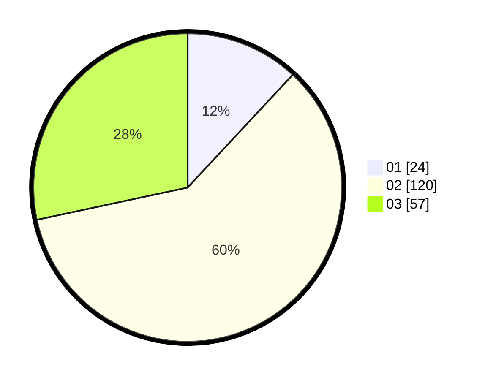

# Hasil

Hasil perolehan suara paslon dapat dilihat pada file paslon-01.txt, paslon-02.txt, dan paslon-03.txt.

Jika tidak ada, artinya data tersebut belum ada pada SIREKAP.

## Perolehan Suara

 * Paslon 01: **24**.
 * Paslon 02: **120**.
 * Paslon 03: **57**.

## Foto C Plano

https://sirekap-obj-formc.kpu.go.id/b4dd/pemilu/ppwp/31/75/03/10/08/3175031008129-20240214-160055--0f110438-e0ba-481e-91a8-a5bfc267831a.jpg

https://sirekap-obj-formc.kpu.go.id/b4dd/pemilu/ppwp/31/75/03/10/08/3175031008129-20240214-185025--14b19bf9-d1a3-469d-9fad-9eec120e75b4.jpg

https://sirekap-obj-formc.kpu.go.id/b4dd/pemilu/ppwp/31/75/03/10/08/3175031008129-20240215-101442--4ac2406f-51b1-4eca-abab-9a5b89c911b1.jpg

## DATA PEMILIH TETAP

Jumlah pemilih dalam DPT: **284**.
 * L: **134**.
 * P: **150**.

## DATA PENGGUNA HAK PILIH

Jumlah pengguna hak pilih dalam DPT: **204**.
 * L: **93**.
 * P: **111**.

Jumlah pengguna hak pilih dalam DPTb: **0**.
 * L: **0**.
 * P: **0**.

Jumlah pengguna hak pilih dalam DPK: **0**.
 * L: **0**.
 * P: **0**.

Jumlah pengguna hak pilih: **204**.
 * L: **93**.
 * P: **111**.

## JUMLAH SUARA SAH DAN TIDAK SAH

JUMLAH SELURUH SUARA SAH: **201**.

JUMLAH SUARA TIDAK SAH: **3**.

JUMLAH SELURUH SUARA SAH DAN SUARA TIDAK SAH: **204**.
