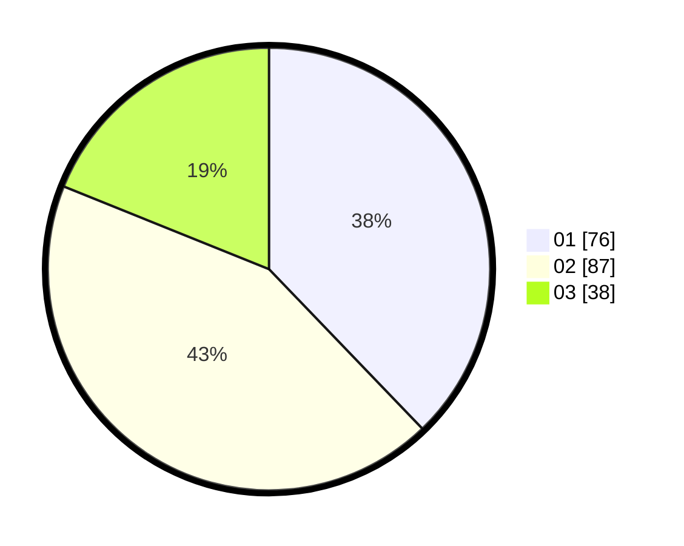

# Hasil

Hasil perolehan suara paslon dapat dilihat pada file paslon-01.txt, paslon-02.txt, dan paslon-03.txt.

Jika tidak ada, artinya data tersebut belum ada pada SIREKAP.

## Perolehan Suara

 * Paslon 01: **76**.
 * Paslon 02: **87**.
 * Paslon 03: **38**.

## Foto C Plano

https://sirekap-obj-formc.kpu.go.id/c477/pemilu/ppwp/31/75/03/10/08/3175031008132-20240215-023925--d4bcd761-fa34-4c6a-99af-5d5f48da2889.jpg

https://sirekap-obj-formc.kpu.go.id/c477/pemilu/ppwp/31/75/03/10/08/3175031008132-20240214-200220--d5bd257e-5c71-497f-ba77-d1b893978fb2.jpg

https://sirekap-obj-formc.kpu.go.id/c477/pemilu/ppwp/31/75/03/10/08/3175031008132-20240215-024136--f3a0051f-da35-4a6c-a13b-e48d36e97625.jpg

## DATA PEMILIH TETAP

Jumlah pemilih dalam DPT: **281**.
 * L: **146**.
 * P: **135**.

## DATA PENGGUNA HAK PILIH

Jumlah pengguna hak pilih dalam DPT: **202**.
 * L: **105**.
 * P: **97**.

Jumlah pengguna hak pilih dalam DPTb: **1**.
 * L: **0**.
 * P: **1**.

Jumlah pengguna hak pilih dalam DPK: **1**.
 * L: **0**.
 * P: **1**.

Jumlah pengguna hak pilih: **204**.
 * L: **105**.
 * P: **99**.

## JUMLAH SUARA SAH DAN TIDAK SAH

JUMLAH SELURUH SUARA SAH: **201**.

JUMLAH SUARA TIDAK SAH: **3**.

JUMLAH SELURUH SUARA SAH DAN SUARA TIDAK SAH: **204**.
