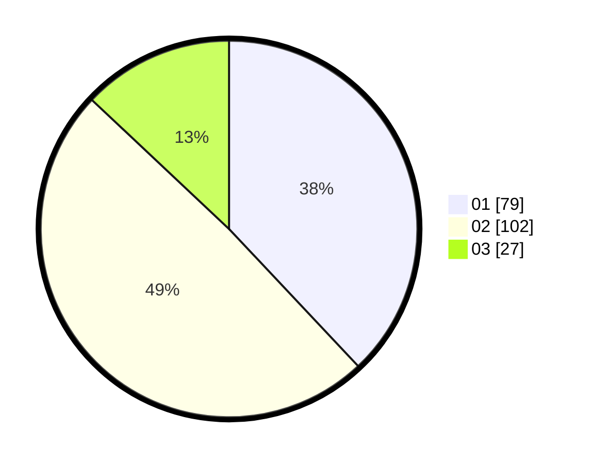

# Hasil

Hasil perolehan suara paslon dapat dilihat pada file paslon-01.txt, paslon-02.txt, dan paslon-03.txt.

Jika tidak ada, artinya data tersebut belum ada pada SIREKAP.

## Perolehan Suara

 * Paslon 01: **79**.
 * Paslon 02: **102**.
 * Paslon 03: **27**.

## Foto C Plano

https://sirekap-obj-formc.kpu.go.id/2a18/pemilu/ppwp/31/75/03/10/08/3175031008133-20240216-135656--d8ede429-ef28-4de3-b383-58e45791c7e3.jpg

https://sirekap-obj-formc.kpu.go.id/2a18/pemilu/ppwp/31/75/03/10/08/3175031008133-20240216-135658--59b9b542-d1c5-4102-acff-b89324ab74eb.jpg

https://sirekap-obj-formc.kpu.go.id/2a18/pemilu/ppwp/31/75/03/10/08/3175031008133-20240216-135657--7bc9cde7-1240-4376-8d25-8b5a433b2d81.jpg

## DATA PEMILIH TETAP

Jumlah pemilih dalam DPT: **282**.
 * L: **135**.
 * P: **147**.

## DATA PENGGUNA HAK PILIH

Jumlah pengguna hak pilih dalam DPT: **211**.
 * L: **104**.
 * P: **107**.

Jumlah pengguna hak pilih dalam DPTb: **0**.
 * L: **0**.
 * P: **0**.

Jumlah pengguna hak pilih dalam DPK: **0**.
 * L: **0**.
 * P: **0**.

Jumlah pengguna hak pilih: **211**.
 * L: **104**.
 * P: **107**.

## JUMLAH SUARA SAH DAN TIDAK SAH

JUMLAH SELURUH SUARA SAH: **208**.

JUMLAH SUARA TIDAK SAH: **3**.

JUMLAH SELURUH SUARA SAH DAN SUARA TIDAK SAH: **211**.
