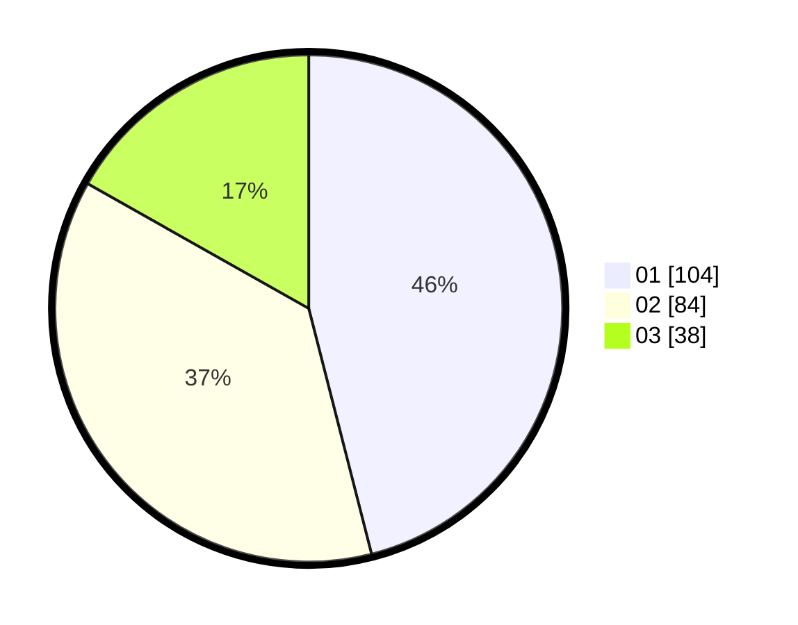

# Hasil

Hasil perolehan suara paslon dapat dilihat pada file paslon-01.txt, paslon-02.txt, dan paslon-03.txt.

Jika tidak ada, artinya data tersebut belum ada pada SIREKAP.

## Perolehan Suara

 * Paslon 01: **104**.
 * Paslon 02: **84**.
 * Paslon 03: **38**.

## Foto C Plano

https://sirekap-obj-formc.kpu.go.id/e249/pemilu/ppwp/31/75/03/10/08/3175031008134-20240214-200734--66ee7c31-4d22-490b-bede-cdc03d97f04e.jpg

https://sirekap-obj-formc.kpu.go.id/e249/pemilu/ppwp/31/75/03/10/08/3175031008134-20240214-201557--ea90164c-76cb-4fb5-8c24-6b7dd3e4bc0b.jpg

https://sirekap-obj-formc.kpu.go.id/e249/pemilu/ppwp/31/75/03/10/08/3175031008134-20240214-195706--45882305-99ec-4acb-8fef-f191712ede15.jpg

## DATA PEMILIH TETAP

Jumlah pemilih dalam DPT: **286**.
 * L: **156**.
 * P: **130**.

## DATA PENGGUNA HAK PILIH

Jumlah pengguna hak pilih dalam DPT: **228**.
 * L: **122**.
 * P: **106**.

Jumlah pengguna hak pilih dalam DPTb: **0**.
 * L: **0**.
 * P: **0**.

Jumlah pengguna hak pilih dalam DPK: **0**.
 * L: **0**.
 * P: **0**.

Jumlah pengguna hak pilih: **228**.
 * L: **122**.
 * P: **106**.

## JUMLAH SUARA SAH DAN TIDAK SAH

JUMLAH SELURUH SUARA SAH: **226**.

JUMLAH SUARA TIDAK SAH: **2**.

JUMLAH SELURUH SUARA SAH DAN SUARA TIDAK SAH: **228**.
