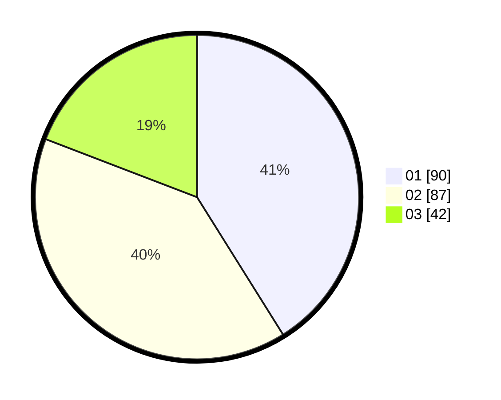

# Hasil

Hasil perolehan suara paslon dapat dilihat pada file paslon-01.txt, paslon-02.txt, dan paslon-03.txt.

Jika tidak ada, artinya data tersebut belum ada pada SIREKAP.

## Perolehan Suara

 * Paslon 01: **90**.
 * Paslon 02: **87**.
 * Paslon 03: **42**.

## Foto C Plano

https://sirekap-obj-formc.kpu.go.id/7a53/pemilu/ppwp/31/75/03/10/08/3175031008135-20240216-144001--94eb990a-8bf6-4a49-adf5-beaec9fe5b53.jpg

https://sirekap-obj-formc.kpu.go.id/7a53/pemilu/ppwp/31/75/03/10/08/3175031008135-20240216-144003--4338addd-3576-427d-9035-dc109fe6f701.jpg

https://sirekap-obj-formc.kpu.go.id/7a53/pemilu/ppwp/31/75/03/10/08/3175031008135-20240216-144002--01df06c8-686d-4df9-9755-78315c675141.jpg

## DATA PEMILIH TETAP

Jumlah pemilih dalam DPT: **285**.
 * L: **138**.
 * P: **147**.

## DATA PENGGUNA HAK PILIH

Jumlah pengguna hak pilih dalam DPT: **217**.
 * L: **97**.
 * P: **120**.

Jumlah pengguna hak pilih dalam DPTb: **2**.
 * L: **1**.
 * P: **1**.

Jumlah pengguna hak pilih dalam DPK: **0**.
 * L: **0**.
 * P: **0**.

Jumlah pengguna hak pilih: **219**.
 * L: **98**.
 * P: **121**.

## JUMLAH SUARA SAH DAN TIDAK SAH

JUMLAH SELURUH SUARA SAH: **219**.

JUMLAH SUARA TIDAK SAH: **0**.

JUMLAH SELURUH SUARA SAH DAN SUARA TIDAK SAH: **219**.
