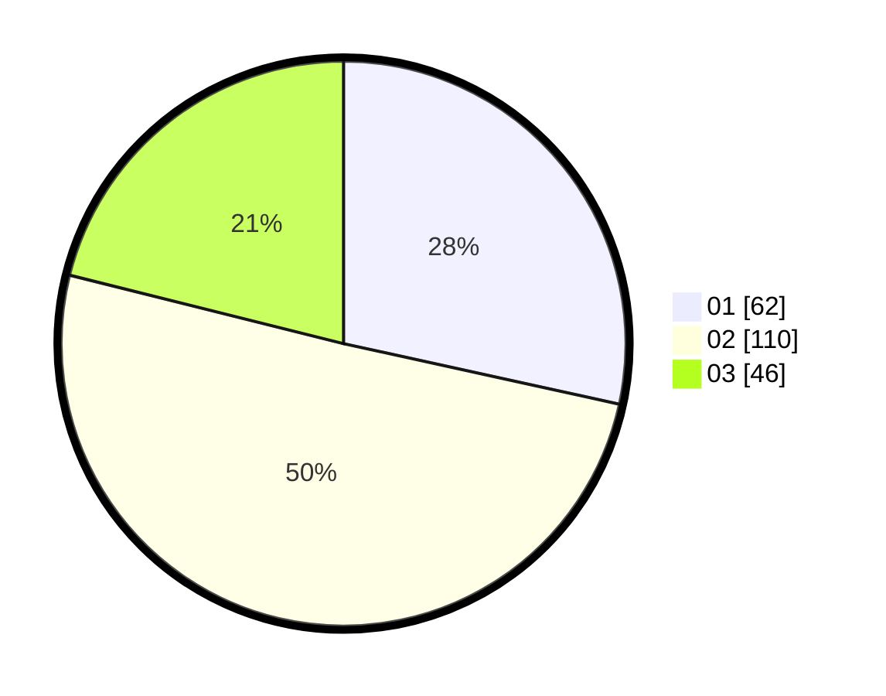

# Hasil

Hasil perolehan suara paslon dapat dilihat pada file paslon-01.txt, paslon-02.txt, dan paslon-03.txt.

Jika tidak ada, artinya data tersebut belum ada pada SIREKAP.

## Perolehan Suara

 * Paslon 01: **62**.
 * Paslon 02: **110**.
 * Paslon 03: **46**.

## Foto C Plano

https://sirekap-obj-formc.kpu.go.id/17c0/pemilu/ppwp/31/75/03/10/08/3175031008137-20240214-195836--fbfb27b6-8e0f-48bf-aeb9-6c80e7fa6b85.jpg

https://sirekap-obj-formc.kpu.go.id/17c0/pemilu/ppwp/31/75/03/10/08/3175031008137-20240214-205111--d6b91cc5-c97d-42f0-9b7c-e47664c8969d.jpg

https://sirekap-obj-formc.kpu.go.id/17c0/pemilu/ppwp/31/75/03/10/08/3175031008137-20240214-200324--739a78c0-4e0a-411a-b58b-862c6ff19153.jpg

## DATA PEMILIH TETAP

Jumlah pemilih dalam DPT: **279**.
 * L: **152**.
 * P: **127**.

## DATA PENGGUNA HAK PILIH

Jumlah pengguna hak pilih dalam DPT: **223**.
 * L: **119**.
 * P: **104**.

Jumlah pengguna hak pilih dalam DPTb: **0**.
 * L: **0**.
 * P: **0**.

Jumlah pengguna hak pilih dalam DPK: **1**.
 * L: **0**.
 * P: **1**.

Jumlah pengguna hak pilih: **224**.
 * L: **119**.
 * P: **105**.

## JUMLAH SUARA SAH DAN TIDAK SAH

JUMLAH SELURUH SUARA SAH: **218**.

JUMLAH SUARA TIDAK SAH: **6**.

JUMLAH SELURUH SUARA SAH DAN SUARA TIDAK SAH: **224**.
