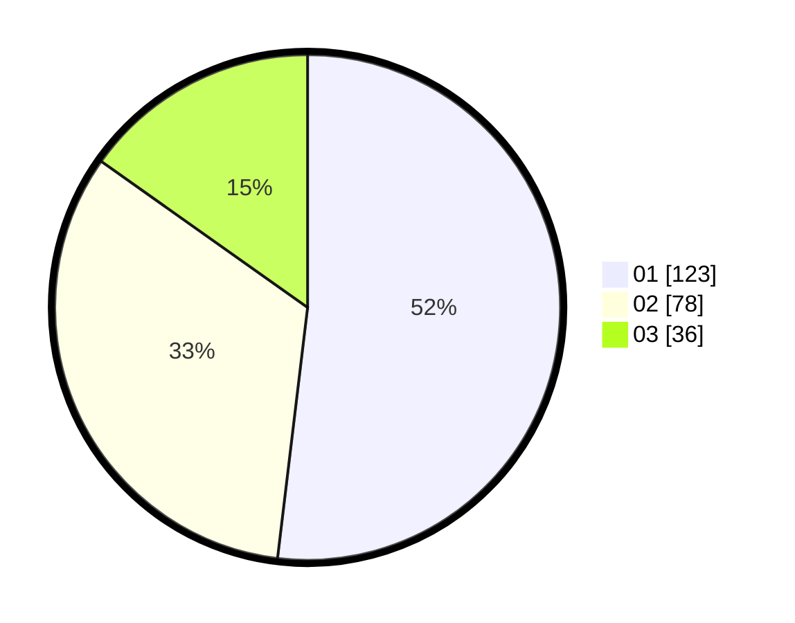

# Hasil

Hasil perolehan suara paslon dapat dilihat pada file paslon-01.txt, paslon-02.txt, dan paslon-03.txt.

Jika tidak ada, artinya data tersebut belum ada pada SIREKAP.

## Perolehan Suara

 * Paslon 01: **123**.
 * Paslon 02: **78**.
 * Paslon 03: **36**.

## Foto C Plano

https://sirekap-obj-formc.kpu.go.id/e5d3/pemilu/ppwp/31/75/03/10/08/3175031008141-20240216-173517--96ab878c-6ebd-4059-a6b7-73f345cff607.jpg

https://sirekap-obj-formc.kpu.go.id/e5d3/pemilu/ppwp/31/75/03/10/08/3175031008141-20240216-173518--771944f7-c115-400b-9d0b-e02244fbebc0.jpg

https://sirekap-obj-formc.kpu.go.id/e5d3/pemilu/ppwp/31/75/03/10/08/3175031008141-20240216-173517--ad86320a-4496-4222-9257-134716a0edaf.jpg

## DATA PEMILIH TETAP

Jumlah pemilih dalam DPT: **279**.
 * L: **139**.
 * P: **140**.

## DATA PENGGUNA HAK PILIH

Jumlah pengguna hak pilih dalam DPT: **235**.
 * L: **112**.
 * P: **123**.

Jumlah pengguna hak pilih dalam DPTb: **0**.
 * L: **0**.
 * P: **0**.

Jumlah pengguna hak pilih dalam DPK: **2**.
 * L: **1**.
 * P: **1**.

Jumlah pengguna hak pilih: **237**.
 * L: **113**.
 * P: **124**.

## JUMLAH SUARA SAH DAN TIDAK SAH

JUMLAH SELURUH SUARA SAH: **237**.

JUMLAH SUARA TIDAK SAH: **0**.

JUMLAH SELURUH SUARA SAH DAN SUARA TIDAK SAH: **237**.
