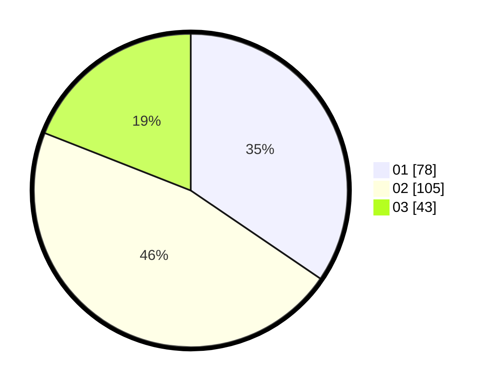

# Hasil

Hasil perolehan suara paslon dapat dilihat pada file paslon-01.txt, paslon-02.txt, dan paslon-03.txt.

Jika tidak ada, artinya data tersebut belum ada pada SIREKAP.

## Perolehan Suara

 * Paslon 01: **78**.
 * Paslon 02: **105**.
 * Paslon 03: **43**.

## Foto C Plano

https://sirekap-obj-formc.kpu.go.id/92ed/pemilu/ppwp/31/75/03/10/08/3175031008144-20240214-235753--e330f07f-5a0d-435e-a01c-0d2af918e1e9.jpg

https://sirekap-obj-formc.kpu.go.id/92ed/pemilu/ppwp/31/75/03/10/08/3175031008144-20240215-000026--157241f5-f92f-457c-bf3c-e9c57711f9ba.jpg

https://sirekap-obj-formc.kpu.go.id/92ed/pemilu/ppwp/31/75/03/10/08/3175031008144-20240214-195052--85c79e1a-ebf9-4e32-b0b0-cdfc329598f0.jpg
